## 목차
- [웹 동작 원리](#웹-동작-원리)
  - [전체적인 흐름](#전체적인-흐름)
  - [TCP/IP Layer](#tcpip-layer)
    - [Physical Layer](#physical-layer)
    - [Data Link Layer](#data-link-layer)
    - [Network Layer](#network-layer)
    - [Transport Layer](#transport-layer)
    - [Application Layer](#application-layer)
  - [정리](#정리)
  - [참고 자료](#참고-자료)

# 웹 동작 원리

## 전체적인 흐름

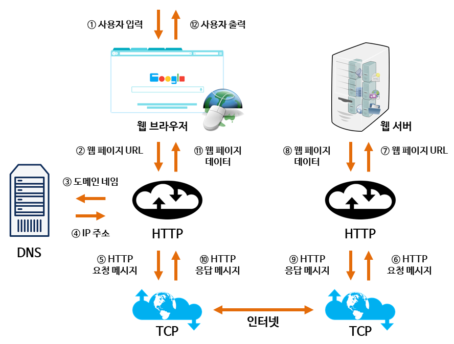

- 출처 : http://tcpschool.com/webbasic/works

1. ⓵, ⓶ 웹 브라우저를 통해 사용자가 찾고 싶은 웹 페이지의 주소를 입력한다.
2. ⓷ 사용자가 입력한 URL 주소 중에서 도메인 네임(domain name) 부분을 DNS 서버에서 검색함.
3. ⓸ DNS 서버는 도메인 네임에 해당하는 IP 주소를 찾아 사용자가 입력한 URL을 함께 전달한다.
4. ⓹, ⓺ URL 정보와 IP 주소는 HTTP 프로토콜을 이용하여 HTTP 요청 메시지를 생성한다.
5. ⓻ 이렇게 도착한 HTTP 요청 메시지는 HTTP 프로토콜을 사용하여 웹 페이지 URL 정보로 변환됨.
6. ⓼ 웹 서버는 도착한 웹 페이지 URL 정보에 해당하는 데이터를 검색함.
7. ⓽ ⑩ 검색된 웹 페이지 데이터는 또 다시 HTTP 프로토콜을 사용하여 HTTP 응답 메시지를 생성함.
8. ⑪ 도착한 HTTP 응답 메시지는 HTTP 프로토콜을 사용하여 웹 페이지 데이터로 변환됨.
9. ⑫ 변환된 웹 페이지 데이터는 웹 브라우저에 의해 출력되어 사용자가 볼 수 있게 됨.

 

 

## TCP/IP Layer

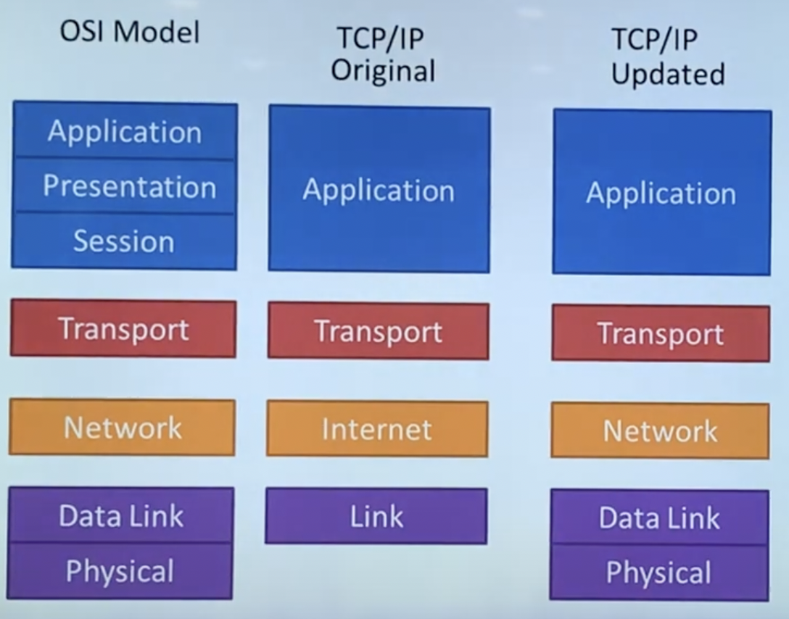

### Physical Layer

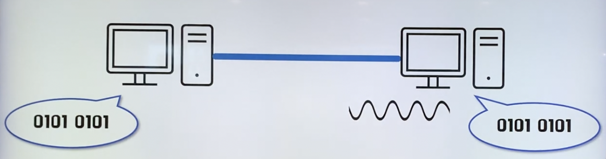

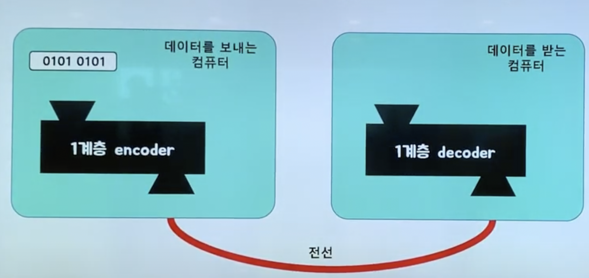

1. 0101 0101 이라는 데이터를 보낸다.
2. 0101 0101 데이터를 아날로그 신호로 바꾸어 전선으로 내보낸다.
3. 수신측 컴퓨터는 받은 아날로그 신호를 해석하여 0101 0101 데이터를 받는다.

Physical Layer는 하드웨어적으로 구현되어 있다.

### Data Link Layer

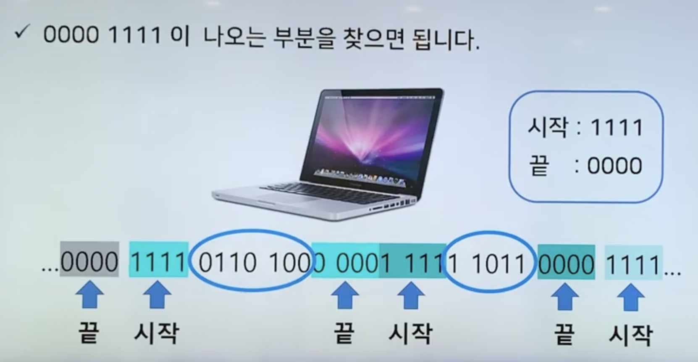
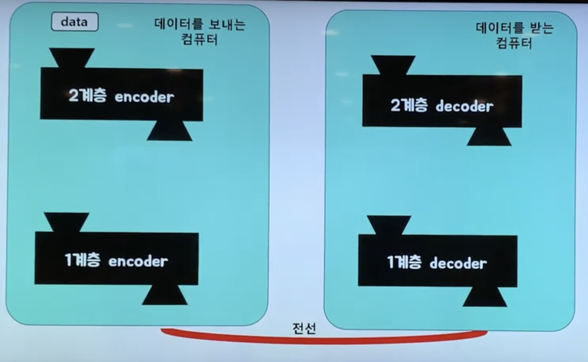

- 원본 데이터를 구분하기 위해 데이터의 앞 뒤에 특정한 비트열을 붙입니다.
- 예를 들어, 데이터를 보낼 때 앞에는 1111, 뒤에는 0000을 붙이는 방식을 사용합니다.
- 원본 데이터를 감싼 것을 프레임(Frame)이라고 한다.

데이터 링크 계층은 하드웨어로 구현되어 있다.

### Network Layer
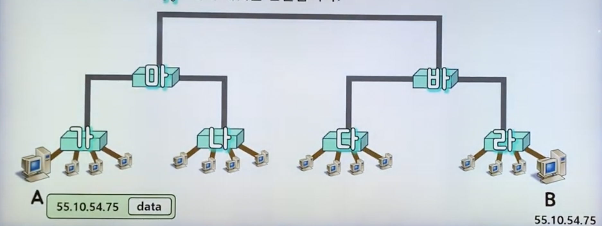
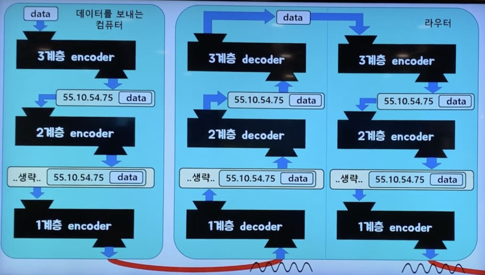

수많은 네트워크들의 연결로 이루어지는 inter-network 속에서 어딘가에 있는 목적지 컴퓨터로 데이터를 전송하기 위해 IP 주소를 이용해서 길을 찾고 자신 다음의 라우터에게 데이터를 넘겨주는 것

운영체제 커널에 소프트웨어로 구현되어 있다.

### Transport Layer
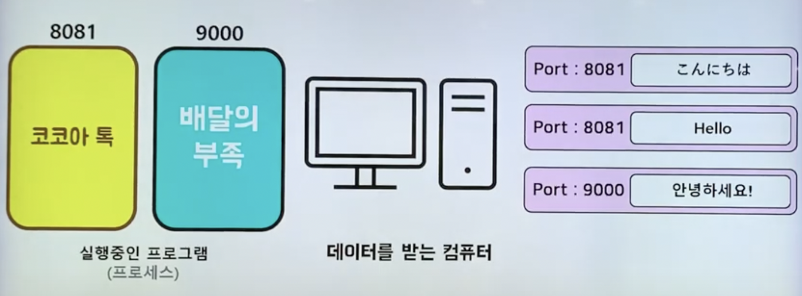
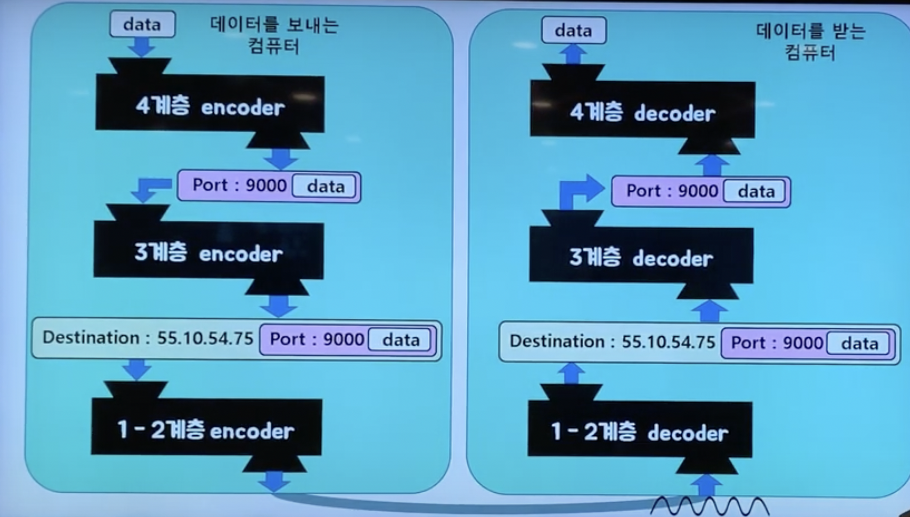

- 각 패킷에 TCP 헤더(port 번호) 추가

port 번호를 사용하여 도착지 컴퓨터의 최종 도착지인 프로세스에 까지 데이터가 도달하게 하는 모듈

운영체제의 커널에 소프트웨어적으로 구현되어 있다.

### Application Layer

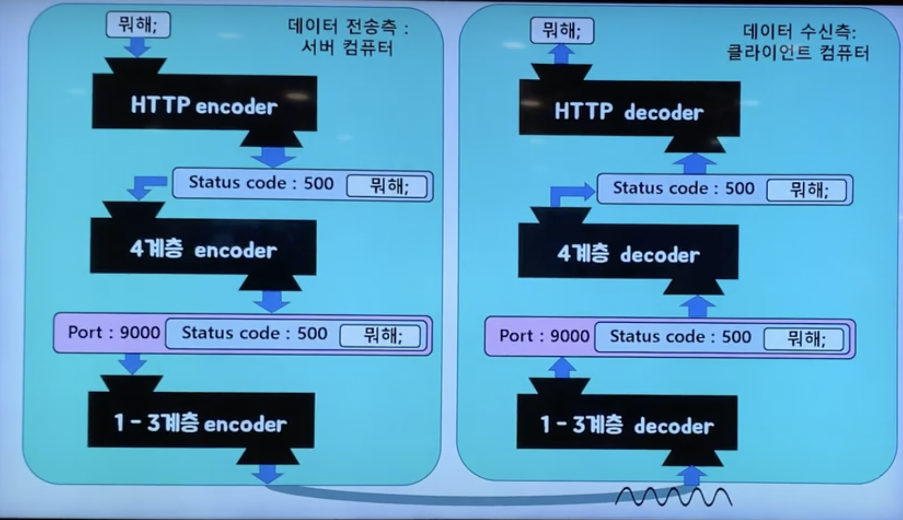

TCP/IP 소켓 프로그래밍
 - 운영체제의 Transport layer에서 제공하는 API를 활용해서 통신 가능한 프로그램을 만드는 것을 TCP/IP 소켓 프로그래밍, 또는 네트워크 프로그래밍 이라고 합니다.

우리가 흔히 아는 HTTP 프로토콜을 사용한다!  
header, body, request, response, status code ...

## 정리
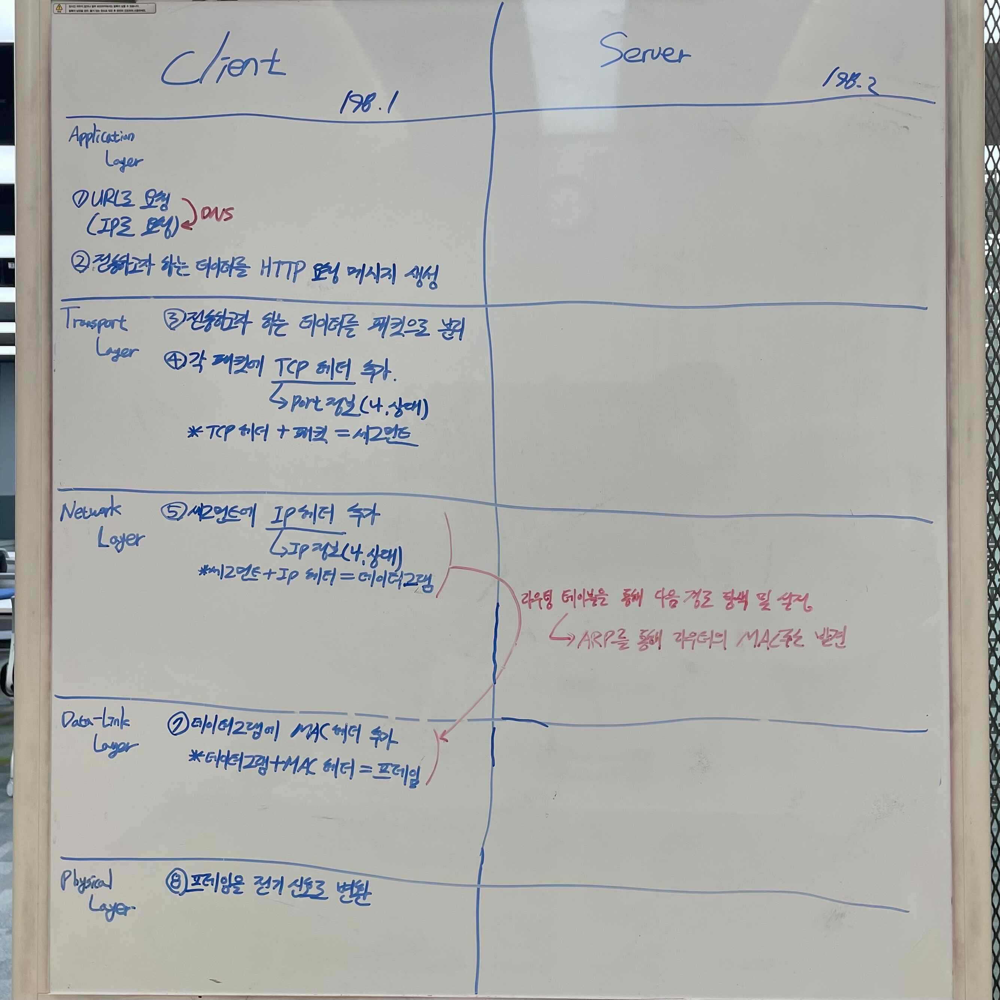

## 참고 자료
- http://tcpschool.com/webbasic/works
- https://velog.io/@junnoli/%EC%9B%B9%EC%9D%98-%EB%8F%99%EC%9E%91-%EC%9B%90%EB%A6%AC
- https://www.youtube.com/watch?v=1pfTxp25MA8&t=17s