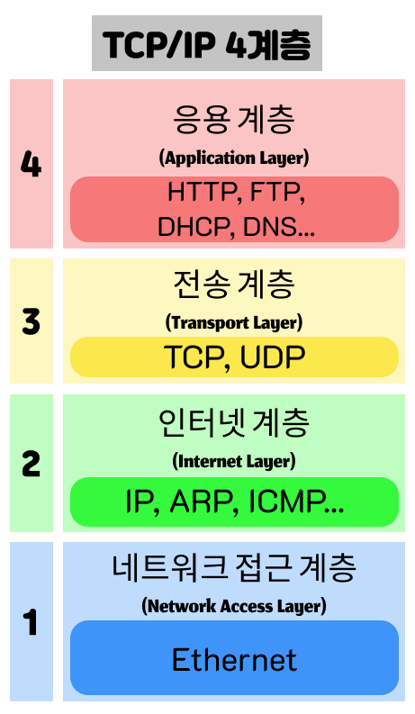
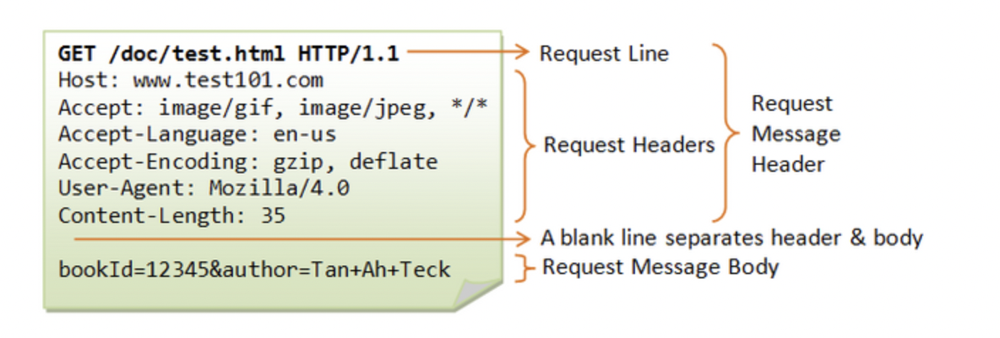
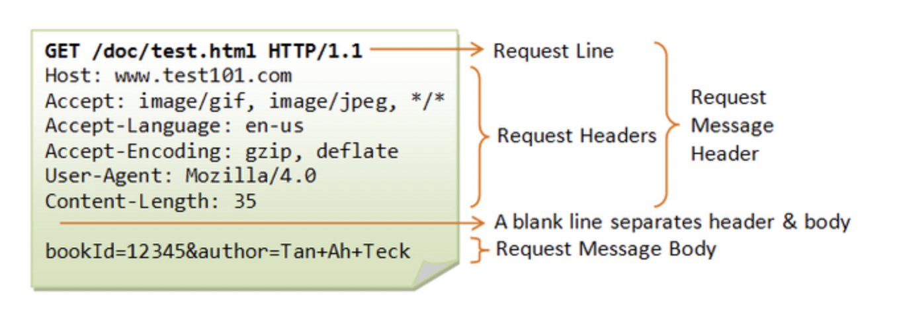
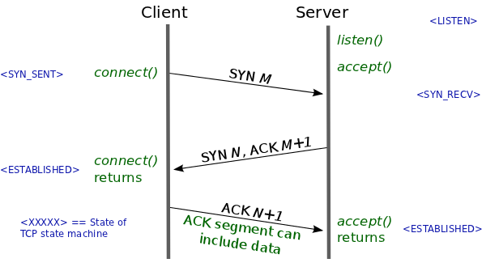
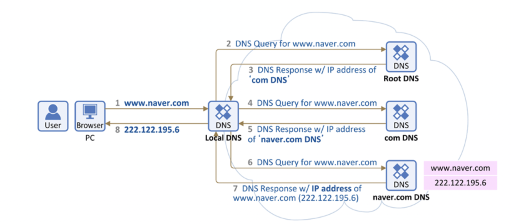

## 목차

# 응용 계층 프로토콜



TCP/ IP 4계층 중 응용 계층에서 사용되는 프로토콜을 알아보겠다

- HTTP/HTTPS
- FTP
- SMTP
- DNS
- TELET
- SSH/TLS
- DHCP

## HTTP/HTTPS
> HTTP(HyperText Transfer Protocol) 프로토콜이란 웹 상에서 정보를 주고 받을 수 있는 프로토콜이다.

서버/클라이언트 모델을 따르며, 애플리케이션 레벨의 프로토콜로 TCP/IP 위에서 작동한다.  
기본 포트는 HTTP는 80번, HTTPS는 443번이다.

### 웹 브라우저 통신 과정
기본적으로 HTTP는 클라이언트에서 요청을 보내면 서버는 요청을 처리해서 응답하는 방식으로 동작한다.

### Connectless & Stateless
HTTP는 Connectless 방식으로 작동한다. 서버에 연결하고, 요청해서 응답을 받으면 연결을 끊어버린다. 기본적으로 자원 하나에 대해서 하나의 연결을 만든다.  

- 장점 : 불특정 다수를 대상으로 하는 서비스에 적합한 방식이다. 수십만명이 웹 서비스를 사용하더라도 접속유지는 최소한으로 할 수 있기 때문에, 더 많은 유저의 요청을 처리할 수 있다.

- 단점: 연결을 끊어버리기 때문에, 클라이언트의 이전 상태를 알 수가 없다. 이러한 HTTP의 특징을 stateless라고 하는데, Connectless로 부터 파생되는 특징이라고 할 수 있다. 하지만 로그인 유지 같은 문제는 클라이언트의 이전 상태를 모르면 유지할 수 없다. 이 때는 쿠키를 이용하여 문제를 해결하고 있다.

### HTTP Request


HTTP 요청의 프로토콜 예시이다.  
요청에 필요한 필드가 몇 가지 명시되어 있다.  
- 요청 메서드 : GET, PUT, POST...  
- 요청 URI: 요청하는 자원의 위치를 명시  
- HTTP 프로토콜 버전: 웹 브라우저가 사용하는 프로토콜 버전
- ...

### HTTP Response


- 웹 브라우저가 사용하는 프로토콜 - 헤더
- 응답 상태 - 헤더
- 응답 메시지
- 바디가 있는 경우 포맷

## HTTP 동작 원리

1. 사용자가 웹 브라우저에 URL 주소 입력
2. DNS 서버에 웹 서버의 호스트 이름을 IP 주소로 변경 요청한다. 
3. 웹 서버와 TCP 연결 시도. (3 way Handshake)
- 3 way Handshake  : 클라이언트 - 서버간 신뢰성있는 연결을 하기 위해 3번의 패킷 교환 과정이다.

SYN : 클라이언트가 서버로 임의로 생성한 시퀀스 번호를 전달한다   
SYN ACK : 서버는 클라이언트에서 전달한 시퀀스를 +1 시켜서 전달한다  (서버의 패킷을 정상 수신했다는 신호)  
ACK : 클라이언트가 서버에서 전달해준 시퀀스를 +1 시켜서 다시 전달함 (서버-클라 간 패킷 교환이 정상적으로 이루어졌다는 신호)
4. 서버에게 GET 명령을 전송한다. 
```
예시)
GET /index.html HTTP/1.1	-> 요청문
Host : www.daum.net		    -> 헤더
Body :                      -> (Get 요청이기 때문에 바디가 없다)
```
5. 서버가 클라이언트에게 데이터(웹 문서)를 회신한다.

```
예시)
HTTP/1.1 200 OK					           -> 상태문
Date: Thu, 12 Feb 2009 06:29:38 GMT 	   -> 헤더 시작
Server: Apache/1.3.29 (Unix) PHP/4.3.4RC3 
X-Powered-By: PHP/4.3.4RC3 
Transfer-Encoding: chunked 
Content-Type: text/html				       -> 헤더 끝
<HTML>							           -> body
<HEAD>
<TITLE> test </TITLE>
</HEAD>
...
```
6. 서버 - 클라이언트간 연결 해제
- 4 way Handshake  : 서버와 클라이언트 양쪽다 연결이 종료시킨다는 메시지를 보낸다. (양쪽 다 각각이므로 4번의 패킷교환이 일어남)  
Client -> Server : FIN  
Server -> Client : ACK  
SERVER -> Client : FIN  
Client -> Server : ACK  

7. 웹 브라우저가 웹 문서를 출력한다.


### HTTP와 HTTPS 차이
SSL은 데이터 보안을 위해서 개발한 통신 레이어이다.  
SSL은 애플리케이션에 있지 않고 바로 아래 계층인 표현 계층에 있다.  
HTTP는 기본적으로 평문으로 데이터를 전송하기 때문에 중요한 정보를 보내기에는 알맞지 않다. 따라서 SSL 레이어 위에 HTTP를 통과 시켜 HTTPS 프로토콜을 보내는 방식을 사용한다.  
그러나 HTTPS는 HTTP에 비해 느리다.

<br>

## DNS
> DNS란 도메인을 IP로 변환하거나 IP를 도메인으로 다시 변경해주는 것을 말한다.

- 포트 번호는 53번을 사용한다.
- TCP/UDP를 사용한다
  - UDP : 평소에 사용
  - TCP : 전송 데이터가 512Byte 이상일때, Zone transfer(존 영역을 전송하는 경우) 사용

DNS 클라이언트의 요청을 DNS로 전달하고 이로부터 IP주소를 받아 클라이언트에게 제공하는 것을 DNS Resolver 혹은 Resolver라고 지칭한다.

### DNS 동작 원리


__브라우저에서 `www.naver.com`을 입력했을 때 상황__
1. PC는 미리 설정되어 있는 Local DNS에게 IP 주소를 물어본다.
2. Lcoal DNS에는 물어본 DNS의 IP 주소가 있을 수도 있고 없을 수도 있다. 만약 있다면 IP 주소를 반환한다.
3. Local DNS에 호스트 네임에 대한 정보가 없을 경우 각 Local DNS에 설정된 Root DNS과 통신을 시작한다.
4. Root DNS 서버는 조금 특별한 DNS인데, 전 세계에 13대가 구축되어 있고 우리나라에는 Root DNS 서버에 대한 미러 서버를 3대를 운용하고 있다.
5. 이 Root 서버는 `www.naver.com`에 대한 IP 주소를 모르므로, 다른 DNS 서버(.com 도메인을 관리하는)에게 물어보라고 응답합니다.
6. (.com) DNS 서버에도 모르기 때문에 (naver.com) DNS 서버에게 물어보라고 응답합니다.
7. (naver.com) DNS 서버에는 `www.naver.com` 에 대한 IP 주소가 있습니다. 따라서 해당 DNS 서버가 `www.naver.com`에 대한 IP 주소를 응답해줍니다.
8. 이를 수신한 Local DNS는 `www.naver.com`에 대한 IP 주소를 캐싱하고 IP 주소 정보를 PC에 전달해 줍니다.

<br>

## FTP
> 파일 전송 프로토콜은 TCP/IP 프로토콜을 가지고 서버와 클라이언트 사이의 파일 전송을 하기 위한 프로토콜이다.

FTP는 20번 21번 두 개의 포트를 사용한다.  

<br>

## SMTP
> 인터넷에 이메일을 보내기 위해 이용되는 프로토콜이다.  
> 포트 번호는 25번이다. TCP를 사용한다.

## DHCP
> DHCP(Dynamic Host Configuration Protocol)은 호스트의 IP주소와 각종 TCP/IP 프로토콜의 기본 설정을 클라이언트에게 자동적으로 제공해주는 프로토콜을 말한다.

- DHCP 장점  
PC의 수가 많거나 PC 자체 변동사항이 많은 경우 IP 설정이 자동으로 되기 때문에 효율적으로 사용 가능하고, IP를 자동으로 할당해주기 때문에 IP 충돌을 막을 수 있습니다.
- DHCP 단점  
DHCP 서버에 의존되기 때문에 서버가 다운되면 IP 할당이 제대로 이루어지지 않습니다.

## 참고 자료
- https://velog.io/@dnjscksdn98/HTTP-%ED%94%84%EB%A1%9C%ED%86%A0%EC%BD%9C%EC%97%90-%EB%8C%80%ED%95%98%EC%97%AC
- https://judo0179.tistory.com/37