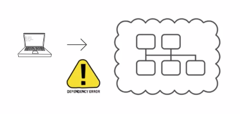
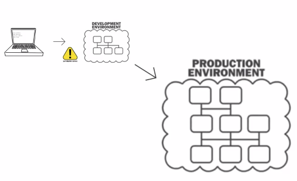

# 수업 내용

## Cloud
인터넷을 통해 원격으로 접근할 수 있는 모든 것을 의미합니다.

__Cloud Computing?__
서버, 데이터베이스, 네트워킹 등 컴퓨팅 리소스를 인터넷을 통해 관리하는 것을 의미합니다.

## 이야기하고 싶은 것들
클라우드를 사용하는 이유?
클라우드를 사용하면 어떤 점이 달라지는지?

## 사용자는 궁금해하지 않아요
사용자는 앱을 실행할 때 아키텍쳐에 대해서는 궁금하지 않는다!

### 관심사의 분리
우리도 마찬가지입니다.
public Cloud를 사용하므로써 서비스 제공자는 편하게 로직 집중!

## 기존의 우리는...
__데이터를 어떻게 관리?__
__서버를 어떻게 관리?__
__네트워크를 어떻게 관리?__

## 개인 PC에서 서비스 할 경우
__데이터를 어떻게 관리?__
- 백업은 어떻게?
- 보안 이슈는?

__서버를 어떻게 관리?__
- 장비를 끌 수는 없는건가?
- 다른 프로그램을 사용해도 영향이 가지 않을까?
- 노트북을 두고 다녀야하나?
- 장비가 망가지면 서비스도 중단될까?

__네트워크를 어떻게 관리?__
- 외부에서 어떻게 접근하지?
- 한번에 몇명이나 접속할까?

## 사무실 서버로 서비스할 경우

__데이터를 어떻게 관리?__
- 다른 팀과 데이터, 코드, 배포본 파일 등은 어떻게 공유하지?
- 데이터 유실??

__서버를 어떻게 관리?__
- 서버 장비관리, OS 설치 등은 누가하지?
- 유휴 장비는 어디에 두지?
- 서버의 전원이 나가면 어떻게 하지?

__네트워크를 어떻게 관리?__
- 네트워크 장비 관리는 누가하지?
- 사무실 서버가 공격받으면 업무도 마비되나?

## 데이터 센터를 활용할 경우

__데이터를 어떻게 관리?__
- 이중화 구성은 어떻게 하지?
- 장기 백업은?

__서버를 어떻게 관리?__
- Rack 관리를 위해 상주 인력을 두어야하나?
- 배포 구성은 어떻게 하지?
- 유휴장비는 얼마나 두어야 할까?

__네트워크를 어떻게 관리?__
- DDoS 대응장비는 있는걸까?
- 보안 구성은 누가하지?
- 보안 관제도 따로 두어야 할까?

## 관심사 분리
서비스 제공자가 집중해야할 것은 서비스의 Core Value 입니다.

ex)
사용자가 지진 관측자료 서비스에 기대하는 것은,
__DB, 네트워크가 어떻게 이동하는가__
가 아닌!
__내가 원하는 지진 관측자료를 제공하는가?__
일 것입니다.

__핵심 가치에 조금 더 집중할 수 있다!!__
