# 우아한 테크코스 수업

## 주요 로직이 컨트롤러에 있는 경우
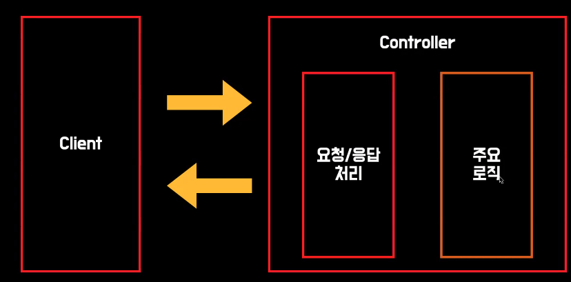

Api가 바뀌면 요청 응답을 수정해야함
하지만 주요 로직과 물려있다면 주요 로직도 변경해야함

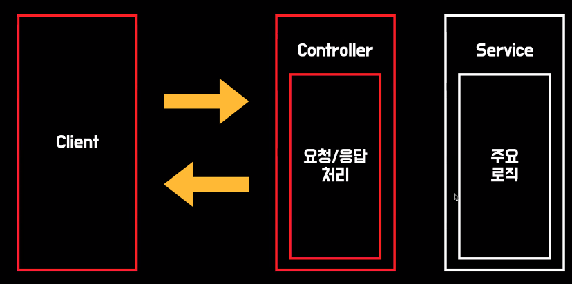

## 주요 로직이 Dao에 있는 경우

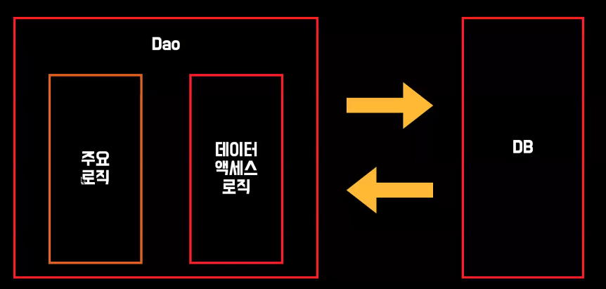

앞서 마찬가지로 변경의 폭이 커짐

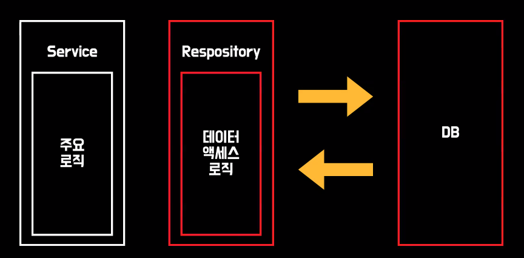

수정이 커질 수 밖에 없음

__Layer별 역할을 명확히 하기__

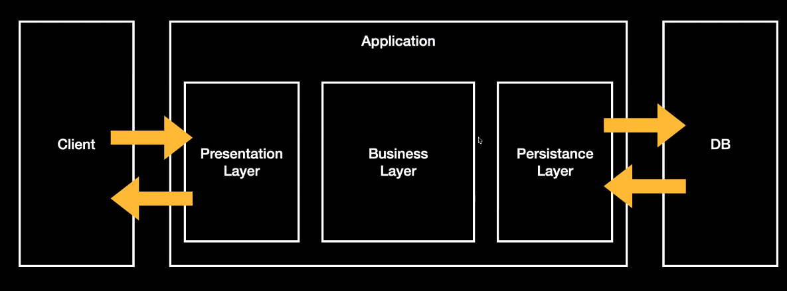

각각 영향을 받는 부분을 분리(격리) 해야함

## 비즈니스 로직은 어디에 위치 해야할까?

__도메인? vs 서비스?__
__도메인을 가볍게 구현 vs 도메인을 풍부하게 구현__

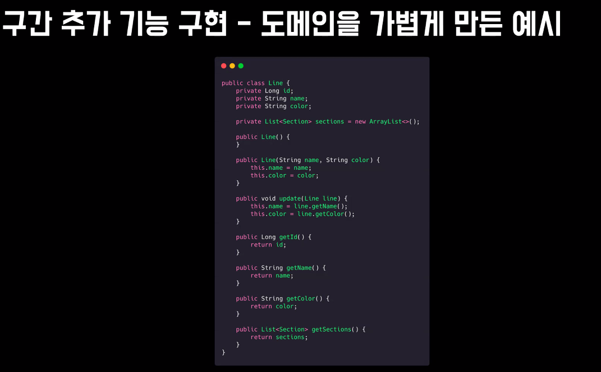

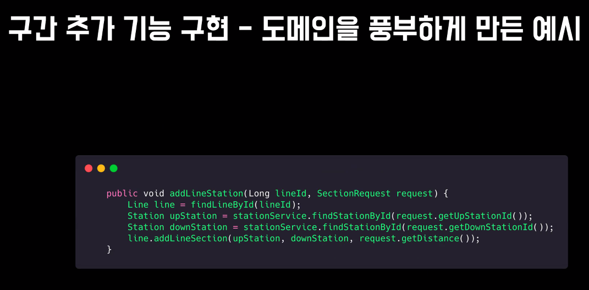

## 인증과 인가

### 인증 과정
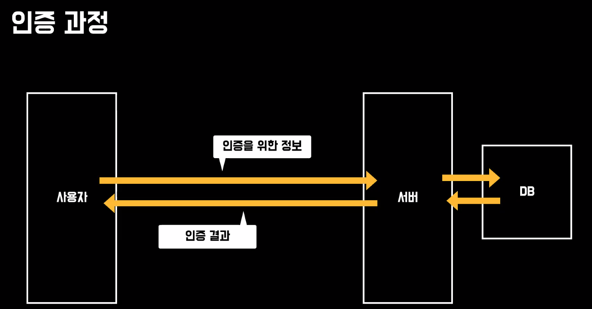

## 세션과 토큰 방식
### 세션
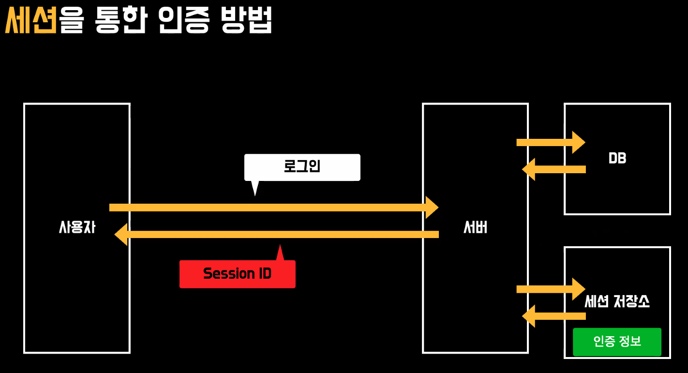

인증 정보를 가리키는 세션 ID 값으로 이용

### 토큰
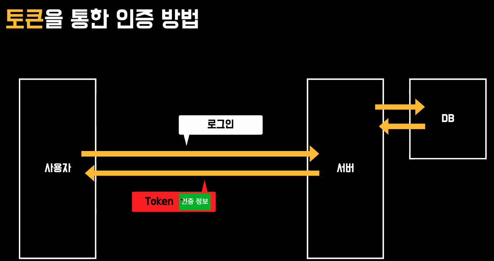

### 인가 과정
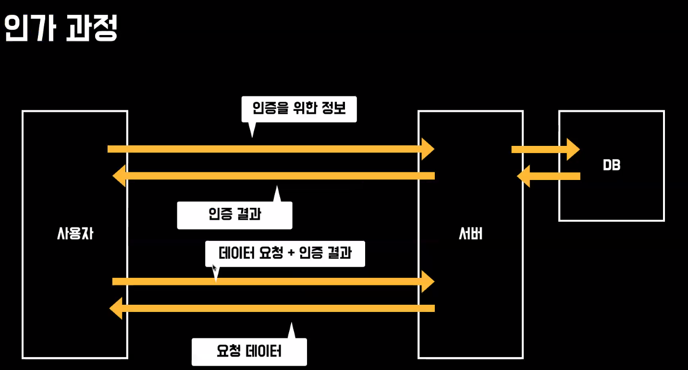

매 요청시 인증을 해야함 -> 번거롭지 않는가? 왜 이렇게 하지?

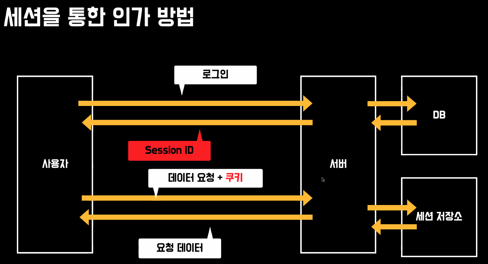

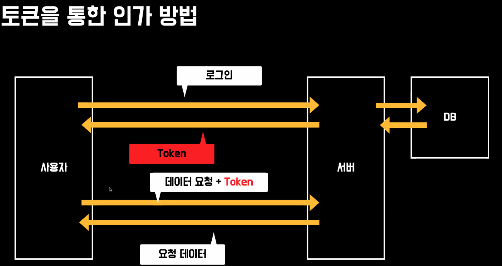

## 권한 체크
권한 체크를 할 때 Controller 마다 붙여줄 수 없으므로 따로 분리

Client와 Servcer 요청이 도착하기 전에 호출

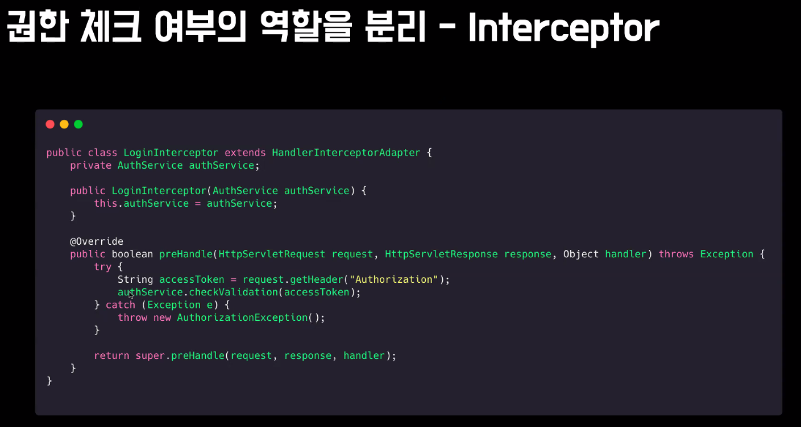

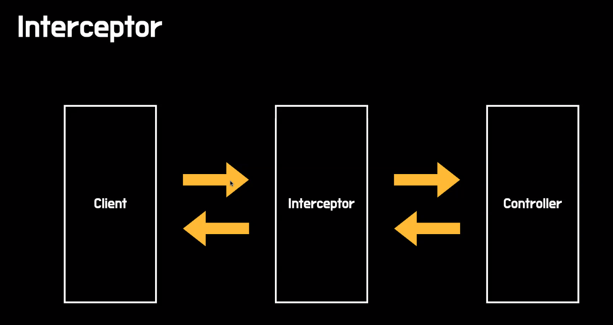

요청 뿐만아니라 응답할 때도 Interceptor가 호출 되어 권한 체크를 한다.

