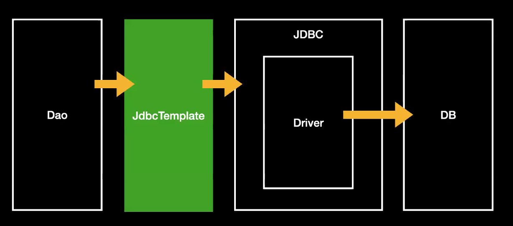

# 우테코 수업

## @Configuration

@Configuration을 붙이면 데이터 설정 클래스

@Bean을 붙이면 빈을 등록할 수 있다.

## @Value 주입

## PropertySourceConfig로 주입

## 컨테이너

## Spring 3.0
Java-based configuration
@ComponentScan

## Spring Boot & Auto Configuration

__Auto Configuration__
별 다른 설정을 안 해주었는데도 마음껏 쓸 수 있다.
@AutoConfiguration 안에 붙어 있는 @EnableAutoConfiguration가 있기 때문에 가능

예시
__JdbcemplateAutoConfiguration__

JdbcTemplate에 대한 따로 설정을 안해도 사용할 수 있었음!