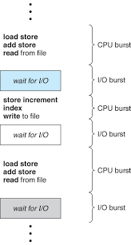
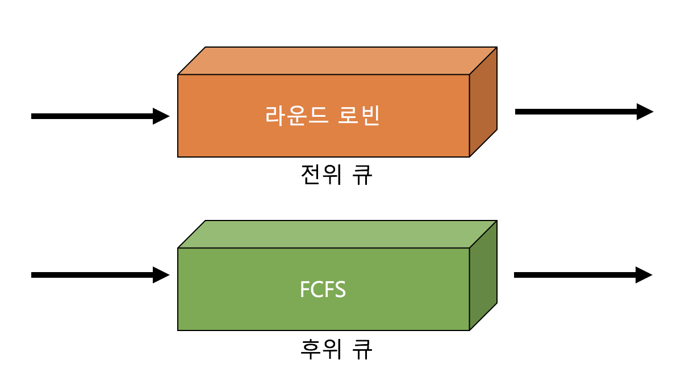
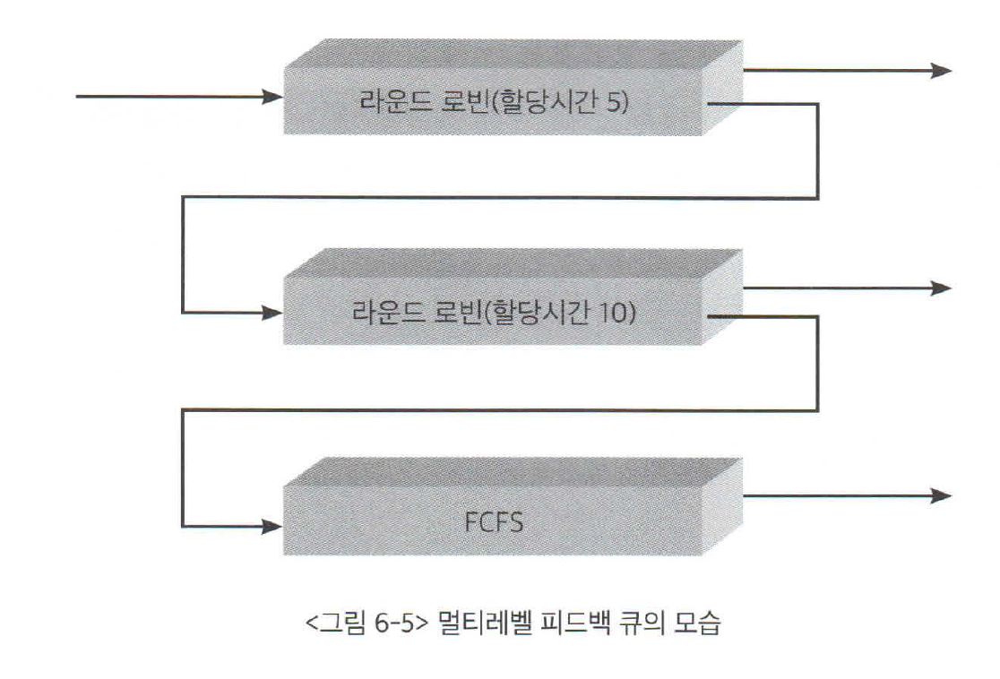

## 목차
- [CPU 스케줄링](#cpu-스케줄링)
    - [기계어 명령](#기계어-명령)
  - [CPU 스케줄러](#cpu-스케줄러)
    - [CPU 스케줄링 방식](#cpu-스케줄링-방식)
    - [디스패처](#디스패처)
  - [스케줄링의 성능 평가](#스케줄링의-성능-평가)
    - [생활 속의 비유](#생활-속의-비유)
  - [스케줄링 알고리즘](#스케줄링-알고리즘)
    - [선입선출 스케줄링](#선입선출-스케줄링)
    - [최단작업 우선 스케줄링](#최단작업-우선-스케줄링)
    - [우선순위 스케줄링](#우선순위-스케줄링)
    - [라운드 로빈 스케줄링](#라운드-로빈-스케줄링)
    - [멀티레벨 큐](#멀티레벨-큐)
    - [멀티레벨 피드백 큐](#멀티레벨-피드백-큐)
    - [다중처리기 스케줄링](#다중처리기-스케줄링)
    - [실시간 스케줄링](#실시간-스케줄링)
  - [스케줄링 알고리즘 평가](#스케줄링-알고리즘-평가)
    - [스케줄링 알고리즘의 성능을 평가하는 방법](#스케줄링-알고리즘의-성능을-평가하는-방법)

# CPU 스케줄링
프로그램이 시작되어 메모리에 올라가면 프로그램 카운터라는 이름의 레지스터가 현재 CPU에서 수행할 코드의 메모리 주소값을 가지고 있게 된다. 그러면 CPU는 프로그램 카운터가 가리키는 주소의 기계어 명령을 하나씩 수행하게 된다.  
CPU는 일반적으로 한 시스템에 하나밖에 없으므로 여러개의 프로그램이 동시에 수행되는 시분할 환경에서 매우 효율적으로 관리되어야 한다.  

### 기계어 명령

__기계여 명령 구분__
- CPU내에서 수행되는 명령
  - add 명령 : CPU 내의 레지스터에 있는 두 값을 더해 레지스터에 저장하는 명령
  - CPU 내에서만 수행되므로 명령의 수행 속도가 매우 빠르다.
- 메모리 접근을 필요로 하는 명령
  - Load 명령 : 메모리에 있는 데이터를 CPU로 읽어들이는 명령
  - Store 명령 : CPU에서 계산된 결과값을 메모리에 저장하는 명령
  - CPU내에서 수행되는 명령보다는 길지만 비교적 짧은 시간에 수행할 수 있는 명령

위 두 가지 명령은 사용자 프로그램이 직접 실행할 수 있는 일반 명령에 해당  

- 입출력을 동반하는 명령
  - 예시
    - 키보드로부터 입력
    - 컴퓨터에서 처리된 결과를 화면에 출력
    - 디스크에서 파일 데이터 읽어오기
    - 컴퓨터에서 처리된 결과를 디스크에 파일 형태로 저장
  - 입출력 명령은 굉장히 오랜 시간이 소요된다.
  - 컴퓨터 시스템에서는 모든 입출력 명령을 특권 명령으로 규정해 사용자 프로그램이 직접 수행할 수 없도록 하고 운영체제를 통해 서비스를 대행하도록 하고 있다.

사용자 프로그램이 수행되는 과정은 CPU작업과 I/O 작업의 반복으로 구성된다.  
사용자 프로그램이 CPU를 직접 가지고 빠른 명령을 수행하는 일련의 단계이고, 둘째는 I/O 요청이 발생해 커널에 의해 입출력 작업을 진행하는 비교적 느린 단계이다.  
전자를 CPU 버스트라고 하고, 후자를 I/O 버스트 라고 부른다.

각 프로그램마다 CPU 버스트와 I/O 버스트가 차지하는 비율이 균일하지는 않다. 이 비율을 통해 I/O 바운드 프로세스와 CPU 바운드 프로세스로 나눌 수 있다.  

__I/O 바운드 프로세스__
- I/O 요청이 빈번해 CPU 버스트가 짧게 나타나는 프로세스다.
- 주로 사용자로부터 인터랙션을 계속 받아가며 프로그램을 수행시키는 대화형 프로그램에 해당된다.
- 짧은 CPU 버스트를 많이 가지고 있다.

__CPU 바운드 프로세스__
- I/O 작업을 거의 수행하지 않아, CPU 버스트가 길게 나타나는 프로세스를 말한다.
- 프로세스 수행의 상당 시간을 입출력 작업 없이 CPU 작업에 소모하는 계산 위주의 프로그램이 해당된다.
- 소수의 긴 CPU 버스트로 구성된다.

CPU 스케줄링은 이와 같이 CPU를 사용하는 패턴이 상이한 여러 프로그램이 동일한 시스템 내부에서 함께 실행되기 때문에 필요한 것이다. 효율적인 CPU 사용을 위해 스케줄링이 필요하다.  

프로세스들의 CPU 버스트 분포는 일반적으로 다수의 짧은 CPU 버스트와 소수의 긴 CPU 버스트로 구성된다. 이는 I/O 작업을 수행하는 프로세스들이 많다는 것이다.  

CPU 버스트가 짧은 프로세스는 대부분 대화형 작업(사용자와 인터랙션)이다. 따라서 이 프로세스는 빠른 서비스를 필요로 한다. 따라서 CPU 스케줄링할 때 CPU 버스트가 짧은 프로세스에게 우선적으로 CPU를 사용할 수 있도록 하는 스케줄링이 필요하다.  

 

## CPU 스케줄러
> CPU 스케줄러는 준비상태에 있는 프로세스들 중 어떠한 프로세스에게 CPU를 할당할지 결정하는 운영체제의 코드이다.

프로세스가 CPU를 할당 받고 명령을 수행하다 타이머 인터럽트가 발생하면 CPU 스케줄러가 호출된다. CPU 스케줄러는 준비 큐에서 CPU를 기다리는 프로세스 중 하나를 선택해 CPU를 할당하게 된다.  

__스케줄링이 필요한 경우__
1. 타이머 인터럽트가 발생하여 다음 CPU 프로세스를 할당할 경우
2. 실행 상태에 있던 프로세스가 I/O 요청등에 의해 봉쇄상태로 바뀌는 경우
3. 실행 상태에 있던 프로세스가 타이머 인터럽트 발생에 의해 준비상태로 바뀌는 경우
4. I/O 요청으로 봉쇄 상태에 있던 프로세스의 I/O 작업이 완료되어 인터럽트가 발생하고 그 결과 이 프로세스의 상태가 준비 상태로 바뀌는 경우
5. CPU에서 실행 상태에 있는 프로세스가 종료되는 경우

### CPU 스케줄링 방식
__비선점형__
- CPU를 획득한 프로세스가 스스로 CPU를 반납하기 전까지는 CPU를 빼앗기지 않는 방법
- 2번, 5번이 비선점형 스케줄링 방식이다.

__선점형__
- 프로세스가 CPU를 계속 사용하기를 원하더라도 강제로 빼앗을 수 있는 스케줄링 방법
- 할당시간을 부여한 후 타이머 인터럽트를 발생시켜 CPU를 빼앗을 수 있다.
- 1번, 3번, 4번이 선점형 스케줄링 방식이다.

### 디스패처
CPU 스케줄러가 어떤 프로세스에게 CPU를 할당해야 할지 결정한 뒤 해당 프로세스에게 실제로 CPU를 이양하는 작업이 필요하다. 선택된 프로세스가 CPU를 할당받고 작업을 수행할 수 있도록 환경설정을 하는 운영체제의 코드를 디스패처라고 부른다.  

__디스패처 과정__  
디스페처는 현재 수행 중이던 프로세스의 문맥을 그 프로세스의 PCB에 저장하고, 새롭게 선택된 프로세스의 문맥을 PCB로부터 복원한 후 그 프로세스에게 CPU를 넘기는 과정을 수행한다. 사용자 프로그램에게 CPU의 제어권을 넘긴다. 사용자 프로그램은 복원된 문맥 중 프로그램 카운터로부터 현재 수행할 주소를 찾을 수 있게 된다. 

__디스패치 지연시간__  
디스패처가 하나의 프로세스를 정지시키고 다른 프로세스에게 CPU를 전달하기까지 걸리는 시간을 디스패치 지연시간이라고 한다. 디스패치 지연시간의 대부분은 문맥교환 오버헤드에 해당된다.

 

## 스케줄링의 성능 평가

__시스템 관점의 지표__
- CPU 이용률
  - CPU 이용률은 전체 시간 중에서 PCU가 일을 한 시간의 비율을 나타낸다.
  - CPU가 일을 하지 않고 휴면 상태에 머무르는 시간을 최대한 줄이는 것이 스케줄링의 중요한 목표가 된다.
- CPU 처리량
  - 주어진 시간 동안 준비 큐에서 기다리고 있는 프로세스 중 몇 개를 끝마쳤는지를 나타낸다.
  - 즉 CPU의 서비스를 원하는 프로세스 중 몇 개가 원하는 만큼의 CPU를 사용하고 준비 큐를 떠났는지 측정한 것이다.

__사용자 관점의 지표__
- 소요시간
  - 프로세스가 CPU를 요청한 시점부터 자신이 원하는 만큼 CPU를 다 쓰고 CPU 버스트가 끝날 때 까지 걸린 시간
  - 즉, 준비 큐에서 기다린 시간과 실제로 CPU를 사용한 시간의 합
  - 프로그램이 시작해 종료하는 데 걸린 시간이 아님에 주의해야한다.
- 대기시간
  - CPU 버스트 기간 중 프로세스가 준비 큐에서 CPU를 얻기 위해 기다린 시간의 합을 뜻한다.
  - 시분할 시스템에서는 타이머를 이용해서 하나의 프로세스가 CPU를 연속적으로 사용할 시간을 제한하므로 한 번의 CPU 버스트 중에서도 준비 큐에서 기다린 시간이 여러 번 발생할 수 있다.
  - 이때는 이번 CPU 버스트가 끝나기 까지 준비 큐에서 기다린 시간의 합을 뜻한다.
- 응답시간
  - 프로세스가 준비 큐에 들어온 후 첫 번쨰 CPU를 획득하기까지 기다린 시간을 뜻한다.
  - 대기 시간과의 차이
    - 대기시간은 준비 큐에 들어온 직후부터 이번 CPU 버스트가 끝날 때까지 준비 큐에서 기다린 시간의 합
    - 응답시간은 준비 큐에 들어온 직후부터 첫 번째 CPU를 얻기까지 걸린 시간
  - 타이머 인터럽트가 빈번히 발생할 수록 각 프로세스가 CPU를 연속적으로 사용할 수 있는 시간이 짧아지므로 처음 CPU를 얻기까지 걸리는 시간은 줄어들게 되어 응답시간은 향상된다.

### 생활 속의 비유
중국집에 주방장과 손님  
- 이용률과 처리량은 중국집 입장에서의 척도
- 소요시간, 대기시간, 응답시간은 손님 입장에서의 척도

 

__중국집__  
- 이용률은 전체 시간 중 주방장이 일한 시간의 비율
- 처리량은 주방장이 주어진 시간동안 몇 명의 손님에게 요리를 만들어주었는지를 나타냄

__손님__
- 소요시간은 손님이 중국집에 들어와서 주문한 음식을 다 먹고 나가기까지 소요된 총 시간
- 대기시간은 음식을 먹은 시간을 제외한 순수하게 기다린 시간
- 이 때 음식이 조금씩 여러번 걸쳐 나왔다면 음식을 먹은 시간을 제외하고 각각의 음식이 나오기까지 기다린 시간을 합한것이 대기시간이 된다.
- 응답시간은 최초의 음식이 나오기까지 기다린 시간을 뜻한다.

 

## 스케줄링 알고리즘

### 선입선출 스케줄링
> 선입선출 스케줄링(First-Come First-Served:FCFS)  
> 프로세스가 준비 큐에 도착한 시간 순서대로 CPU를 할당하는 방식을 말한다.

CPU를 먼저 요청한 프로세스에게 CPU를 먼저 할당하고, 그 프로세스가 자발적으로 CPU를 반납할 때까지 빼앗지 않는다.

### 최단작업 우선 스케줄링
> 최단작업 우선 스케줄링(Shortest-Job First: SJF)  
> CPU 버스트가 가장 짧은 프로세스에게 제일 먼저 CPU를 할당하는 방식이다.

SJF 알고리즘은 비선점형 방식과 선점형 방식 두 가지로 구현될 수 있다. SJF 알고리즘에서 비선점형은 해당 프로세스가 자진 반납하기 전까지는 CPU를 빼앗지 않고, 선점형은 CPU 버스트가 더 짧은 프로세스가 오면 현재 수행중인 프로세스에게서 빼앗아 더 짧은 프로세스에게 할당한다.  

SJF 스케줄링 기법의 구현에서 현실적으로 어려운 부분은 프로세스의 CPU 버스트 시간을 미리 알 수 없다는 점이다. 그래서 과거의 CPU 버스트 시간을 통해 예측하여 할당한다.  

SJF 알고리즘이 평균 대기시간을 최소화하는 알고리즘이기는 하지만 시스템에서 평균을 줄이는 것이 항상 좋은 방식이라고 말할 수 없다. 계속 CPU 버스트가 짧은 프로세스에게만 CPU를 할당할 경우 CPU 버스트가 긴 프로세스는 준비 큐에 서서 무한정 기다려야 하는 문제가 발생한다. 이러한 현상을 우리는 __기아 현상__ 이라고 하며, 이는 SJF 알고리즘의 심각한 문제점이다.

### 우선순위 스케줄링
> 우선순위 스케줄링(priority scheduling)  
> 준비 큐에서 기다리는 프로세스들 중 우선순위가 가장 높은 프로세스에게 제일 먼저 CPU를 할당하는 방식

우선순위 스케줄링에서 우선순위는 우선순위 값을 통해 표시하며 우선순위값이 작을수록 높은 우선순위를 가지는 것으로 가정한다.   
우선순위를 결정하는 방식은 여러가지가 있다.

우선순위 스케줄링도 비선점형 방식과 선점형 방식으로 각각 구현할 수 있다.  

우선순위 스케줄링 방식에서의 문제점 중 하나는 __기아 현상__ 이 발생할 수 있다는 점이다. 이러한 문제점을 해결하기 위해 노화(aging) 기법을 사용할 수 있다.

### 라운드 로빈 스케줄링
> 라운드 로빈 스케줄링(Round Robin Scheduling)  
> 각 프로세스가 CPU를 연속적으로 사용할 수 있는 시간이 특정 시간으로 제한되며, 이 시간이 경과하면 해당 프로세스로부터 CPU를 회수해 준비 큐에 줄 서 있는 다른 프로세스에게 CPU를 할당한다. 그러면 이 프로세스는 준비 큐의 제일 뒤에가서 줄을 서 다음번 차례가 오기를 기다린다.  

각 프로세스마다 한 번에 CPU를 연속적으로 사용할 수 있는 최대시간을 __할당시간__ 이라고 부른다.

할당시간이 너무 실면 FCFS와 같은 결과를 나타내게 된다.  
반면 할당시간이 너무 짧으면 CPU를 사용하는 프로세스가 빈번하게 교체되어 문맥교환의 오버헤드가 커진다.  
따라서 적절한 할당 시간을 적용시켜줘야한다.

### 멀티레벨 큐
> 멀티레벨 큐  
> 준비 큐를 여러 개로 분할해 관리하는 스케줄링 기법

멀티레벨 큐는 프로세스들이 CPU를 기다리기 위해 한 줄로 서는 것이 아닌 여러 줄로 서는 것이다.  
CPU는 하나밖에 없으므로 어떤 줄에 서있는 프로세스를 우선적으로 스케줄링 할 것인지, 프로세스를 어떤 줄에 세워야할지에 대한 문제가 발생한다.  

멀티 레벨 큐는 일반적으로 성격이 다른 프로세스들을 별도로 관리하고, 프로세스의 성격에 맞는 스케줄링을 적용하기 위해 준비 큐를 별도로 두게 된다.  

예를 들면, 빠른 응답이 필요한 작업(대화형 작업)과 그렇지 않은 작업)계산 위주의 작업)을 나누어 별도 큐에 줄 세우는 것이다.  
일반적으로 전위 큐(대화형 작업)은 라운드 로빈, 후위 큐(계산 위주의 작업)은 FCFS 스케줄링 기법을 사용한다.  

멀티 레벨 큐에서는 어떤 큐에 먼저 CPU를 할당할 것인지 결정하는 스케줄링도 필요하다.  
고정 우선순위 방식(fixed priority)은 큐에 우선 순위를 부여해 우선 순위가 높은 고정 큐에 CPU를 우선적으로 할당한다.  
타임 슬라이스 방식은 각 큐에 CPU 시간을 적절한 비율로 할당하는 방식이다.

### 멀티레벨 피드백 큐
멀티 레벨 피드백 큐는 밀티레벨 큐와 동일하나, 프로세스가 하나의 큐에서 다른 큐로 이동 가능하다는 점이 다르다.

예를 들어, 우선 순위 스케줄링에서 노화 기법을 이용하여, 우선순위가 낮은 큐에서 오래 기다렸으면 우선순위가 높은 큐로 승격시키는 방법을 사용할 수 있다.  

멀티 레벨 피드백 큐를 정의하는 요소들로는 큐의 수, 스케줄링 알고리즘, 프로세스를 상위 큐로 승격시키는 기준, 강등시키는 기준, 프로세스가 들어갈 큐를 결정하는 기준 등이 있다.

### 다중처리기 스케줄링
> 다중처리기 시스템  
> CPU가 여러 개인 시스템

다중 처리기 시스템에서는 프로세스를 준비 큐에 한 줄로 세워서 각 CPU가 알아서 다음 프로세스를 꺼내어 가도록 할 수 있다.  
은행 창구와 비슷하다.  

만약 반드시 특정 CPU에서 수행되어야 하는 프로세스가 있는 경우 CPU 별로 줄 세우기를 할 수도 있다.  
미용실의 특정 헤어디자이너와 비슷하다.

여러 줄로 줄 세우기를 할 경우 하나의 CPU에 몰리지 않게 하기위해 부하 균형 메커니즘이 필요하다.  
다중처리기 스케줄링은 대칭형 다중처리, 비대칭형 다중처리로 나누어진다.  

대칭형 다중처리는 각 CPU가 알아서 스케줄링을 결정하는 방식이다.  
비대칭형 다중처리는 하나의 CPU가 다른 모든 CPU의 스케줄링 및 데이터 접근을 책임지고 나머지 CPU는 거기에 따라서 움직이는 방식을 말한다.  

### 실시간 스케줄링

일반적으로 특정 시간 이내에 처리하지 못했다고 해서 심각한 상황이 발생하지 않는다. 그러나 실시간 시스템에서는 정해진 시간안에 작업을 처리해야한다.  
이러한 경우 데드라인이 얼마 남지 않은 요청부터 처리하게 된다.  

 

## 스케줄링 알고리즘 평가

### 스케줄링 알고리즘의 성능을 평가하는 방법
- 큐잉 모델
- 시뮬레이션
- 구현 및 실측