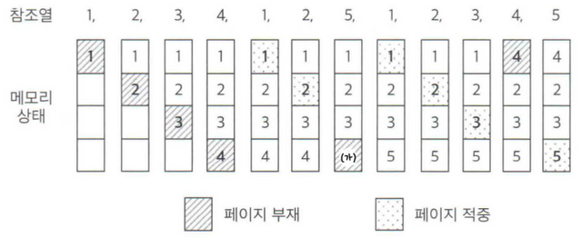
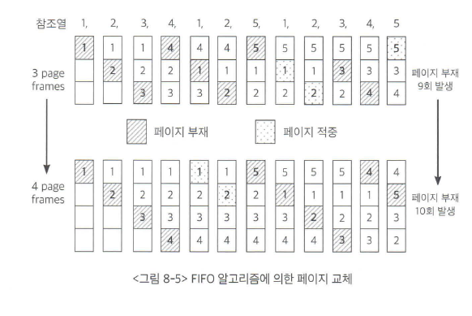
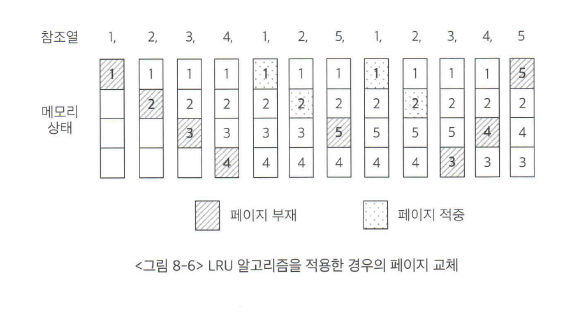
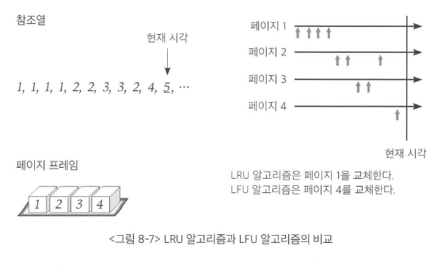

## 목차
- [가상메모리](#가상메모리)
  - [요구 페이징](#요구-페이징)
    - [요구 페이징의 페이지 부재 처리](#요구-페이징의-페이지-부재-처리)
    - [요구 페이징의 성능](#요구-페이징의-성능)
  - [페이지 교체](#페이지-교체)
    - [최적 페이지 교체](#최적-페이지-교체)
    - [선입선출 알고리즘](#선입선출-알고리즘)
    - [LRU 알고리즘](#lru-알고리즘)
    - [LFU 알고리즘](#lfu-알고리즘)
    - [클럭 알고리즘](#클럭-알고리즘)

# 가상메모리
여러 프로그램이 동시에 수행되는 시분할 환경에서는 한정된 메모리 공간을 여러 프로그램이 조금씩 나누어 사용한다. 따라서 운영체제는 어떤 프로그램에게 어느 정도의 메모리를 할당할 것인가 하는 문제에 당면하게 된다. 운영체제는 모든 프로그램에게 공평하게 메모리를 할당하기보다는 집중적으로 할당한 후, 다시 다른 프로그램에게 집중적으로 할당하는 방식을 채택한다.  

프로그램이 실행되기 위해서 프로세스 주소 공간 전체가 메모리에 올라와있어야 하는 것은 아니다. 따라서 운영체제는 CPU에서 당장 수행해야 할 부분만을 메모리에 올려놓고 그렇지 않은 부분은 디스크의 스왑 영역에 올려놓았다가 필요해지면 교체하는 방식을 사용한다.  

운영체제는 프로그램이 자기 자신만이 메모리를 사용하는 것처럼 가장해 프로그램하는 것을 지원한다. 이렇게되면 프로그램은 0번지부터 시작하는 자기 자신만의 메모리 주소 공간을 가정할 수 있는데, 이러한 메모리 공간을 가상 메모리라고 부른다. 가상 메모리는 프로세스마다 0번지부터의 주소 공간을 가지게 되며, 이들 공간 중 일부는 물리적 메모리에 적재되고 일부는 디스크의 스왑 영역에 존재하게 된다.  

프로세스의 주소 공간을 메모리로 적재하는 단위에 따라 가상 메모리 기법은 요구 페이징 방식과 요구 세그먼테이션 방식으로 구현될 수 있다.

 

## 요구 페이징
> 요구 페이징  
> 프로그램 실행 시 프로세스를 구성하는 모든 페이지를 한꺼번에 메모리에 올리는 것이 아니라 당장 사용될 페이지만을 올리는 방식

요구 페이징 기법에서는 당장 실행에 필요한 페이지만을 메모리에 적재하기 때문에 메모리 사용량이 감소하고, 프로세스 전체를 메모리에 올리는데 소요되는 입출력 오버헤드도 줄어든다.  
이는 응답시간을 단축시킬 수 있고, 시스템이 더 많은 프로세스를 수용할 수 있게 해주며, 물리적 메모리의 용량 제약을 벗어날 수 있다.  

가상 메모리 기법에서는 프로세스가 실행되는 동안 일부 페이지만 메모리에 올라와 있고 나머지 페이지는 디스크의 스왑영역에 존재한다. 이를 구분하기 위해서 유효-무효 비트를 사용한다.  
만약 특정 페이지가 참조되어 메모리에 적재되는 경우 해당 페이지의 유효-무효 비트는 유효값으로 바뀌게 된다. 그리고 메모리에 적재되어 있던 페이지가 디스크의 스왑영역으로 쫓겨날 때는 유효-무효 비트가 다시 무효 값을 가지게 된다. 이 때 무효로 세팅되어 있는 경우를 __페이지 부재__ 가 일어났다고 한다.  

### 요구 페이징의 페이지 부재 처리
CPU가 무효 페이지에 접근할 경우 다음과 같은 처리과정을 거치게 된다.  

1. 운영체제는 해당 페이지에 대한 접근이 가능한지 체크한다.
2. 사용되지 않는 주소영역에 속한 페이지에 접근하려 했거나 해당 페이지에 대한 접근 권한 위반을 했을 경우 해당 프로세스를 종료시킨다.
   - ex) 읽기 전용인 페이지에 쓰기 접근 시도를 했을 경우
3. 접근이 가능하면 물리적 메모리에서 비어있는 프레임을 할당받아 그 공간에 해당 페이지를 읽어온다.
4. 만약 비어있는 프레임이 없다면 메모리에 올라와 있는 페이지 중 하나를 디스크로 쫓아낸다.(스왑 아웃)

### 요구 페이징의 성능
요구 페이징 기법의 성능에 가장 큰 영향을 미치는 요소는 페이지 부재의 발생 빈도이다. 페이지 부재가 일어나면 요청된 페이지를 디스크로부터 메모리로 읽어오는 막대한 오버헤드가 발생하기 때문이다.

 

## 페이지 교체
페이지를 메모리로 읽어올 때, 물리적 메모리에 빈 프레임이 존재하지 않을 수도 있다. 이 경우에는 메모리에 올라와있는 페이지 중 하나를 디스크로 쫓아내 빈 공간을 확보해야한다. 이를 페이지 교체라고한다.  

이 때 어떤 페이지를 디스크로 쫓아낼 것인지 정하는 알고리즘을 교체 알고리즘이라고 한다. 이 알고리즘의 목표는 페이지 부재율을 최소화하는 것이다. 즉, 가까운 미래에 참조될 가능성이 가장 적은 페이지를 선택해서 내쫓는 것이 성능을 향상 시킬 수 있다.  

페이지 교체 알고리즘의 성능은 주어진 페이지 참조열에 대해 페이지 부재율을 계산함으로써 평가할 수 있다.

__페이지 참조열 예시__

1, 2, 3, 4, 1, 2, 5, 1, 2, 3, 4, 5

### 최적 페이지 교체

페이지 부재율을 최소화 하기 위해서는 페이지 교체 시 물리적 메모리에 존재하는 페이지 중 가장 먼 미래에 참조될 페이지를 쫓아내면 된다. 이러한 최적의 알고리즘을 __빌레디의 최적 알고리즘__ 이라고 부른다.  
이 알고리즘은 페이지가 어떤 순서로 들어올지 미리 알고 있다는 전제하에 운영하므로 실제 온라인에서 사용할 수는 없다. 하지만 어떠한 알고리즘보다도 가장 적은 부재율을 보장하므로 상한선을 제공한다. 따라서 기준으로 삼으면 된다!

### 선입선출 알고리즘
> 선입선출 알고리즘(First In First Out: FIFO)  
> 페이지 교체 시 물리적 메모리에 가장 먼저 올라온 페이지를 우선적으로 내쫓는다.  

FIFO 알고리즘은 비효율적인 상황이 발생할 수 있다. 위의 그림처럼 오히려 물리적 메모리 공간이 늘어났음에도 9회에서 10회로 증가함을 볼 수가 있다. 이러한 현상을 FIFO의 이상현상(FIFO anomaly)라고 부른다. LRU 알고리즘에서는 이러한 현상이 발생하지 않는다.

### LRU 알고리즘
> LRU 알고리즘(Least Recently Used)  
> 마지막 참조 시점이 가장 오래된 페이지를 교체하는 방식

페이지 5번이 도달했을 때 3번이 가장 예전에 참조됬으므로 3번자리에 5번을 교체하게 된다.

### LFU 알고리즘
> LFU 알고리즘(Least Frequently Used)  
> 페이지의 참조 횟수로 교체시킬 페이지를 결정하는 방식

LFU 알고리즘은 LRU 알고리즘보다 오랜 시간 동안의 참조 기록을 반영할 수 있다는 장점이 있다. LRU는 직전에 참조된 시점만을 반영하지만 LFU는 참조 횟수를 통해 장기적인 시간 규모에서의 참조 성향을 고려하기 때문이다.

위의 그림처럼 LRU와 LFU는 다른 양상을 보인다. 5번이 페이지 프레임에 들어가야할 상황에서 LRU는 가장 오래전에 참조된 페이지 1을 교체하고 LFU는 가장 참조 횟수가 적은 4번을 교체한다.  

### 클럭 알고리즘
클럭 알고리즘은 하드웨어적인 자원을 통해 이와 같은 알고리즘의 운영 오버헤드를 줄인 방식이다. 클럭 알고리즘은 LRU를 근사시킨 알고리즘이다.  
클럭 알고리즘은 최근에 참조되지 않은 페이지를 교체 대상으로 선정한다는 측면에서 LRU와 유사하지만 교체되는 페이지의 참조 시점이 가장 오래되었다는 것을 보장하지 못한다는 점에서 LRU를 근사시킨 알고리즘이라고 볼 수 있다.  
이 알고리즘은 하드웨어적인 자원으로 동작하기 때문에 LRU에 비해 페이지의 관리가 훨씬 빠르고 효율적으로 이루어진다. 따라서 대부분의 시스템은 클럭 알고리즘을 사용한다.
