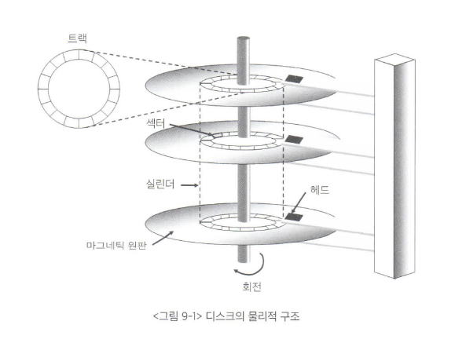
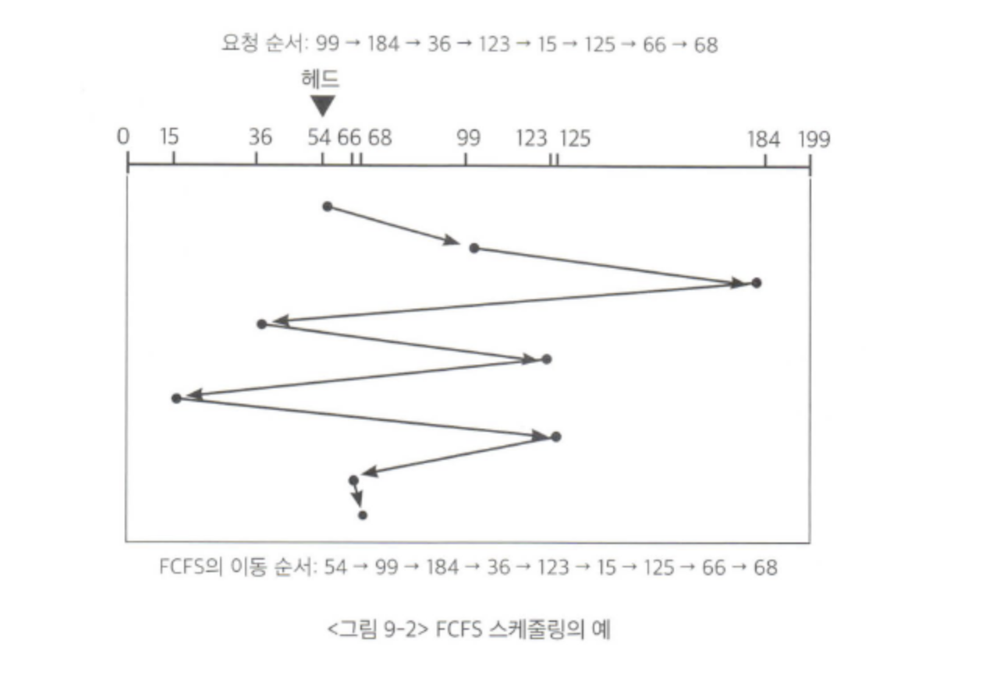
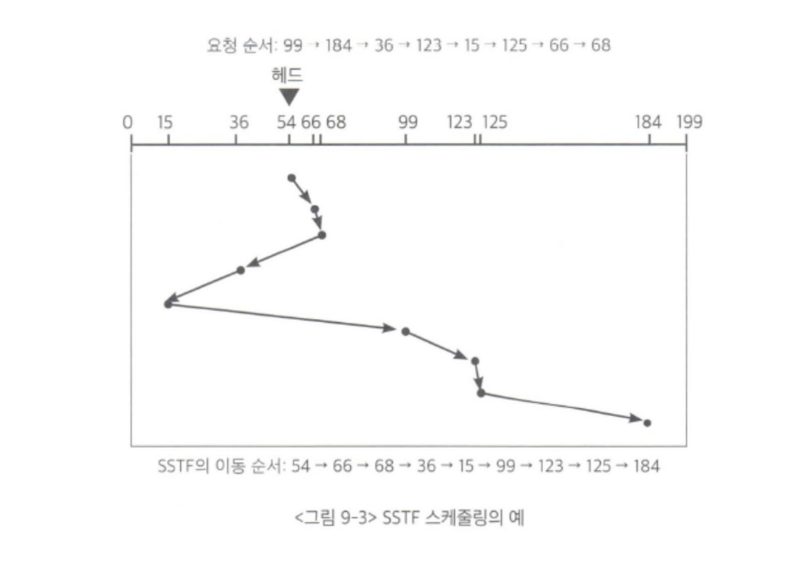
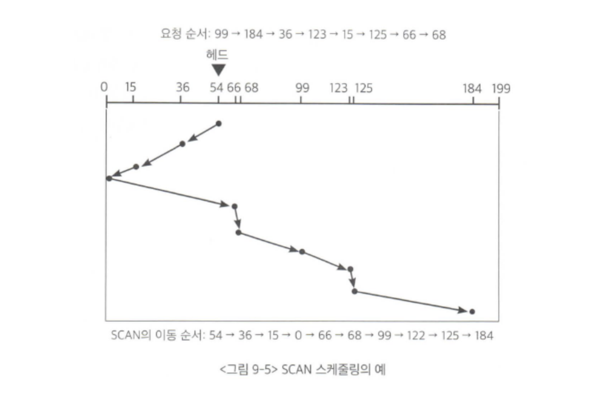
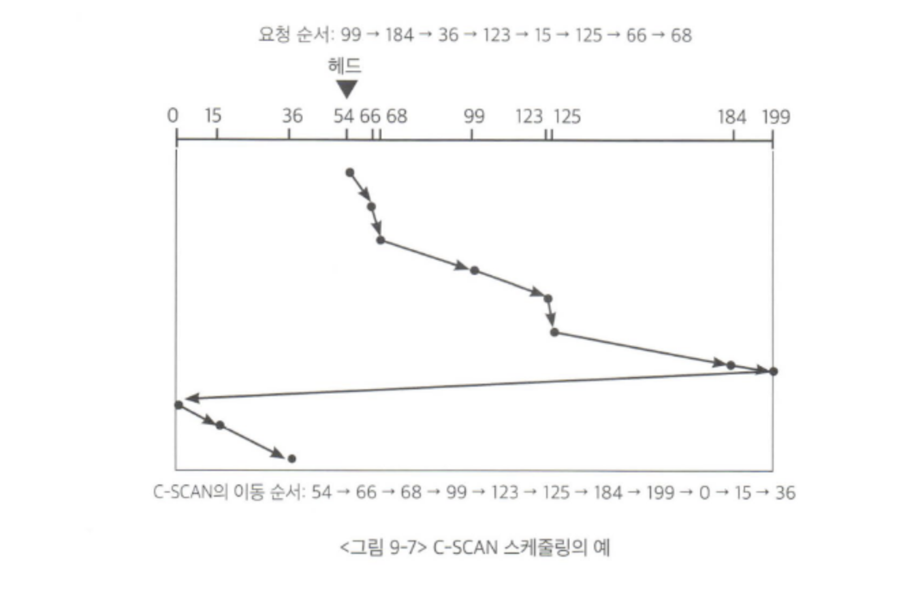
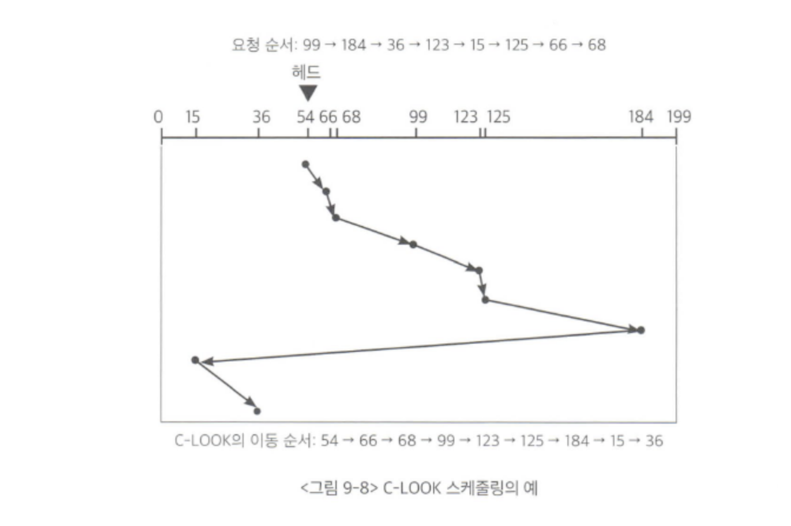

## 목차
- [디스크 관리](#디스크-관리)
  - [디스크 구조](#디스크-구조)
  - [디스크 스케줄링](#디스크-스케줄링)
    - [FCFS 스케줄링](#fcfs-스케줄링)
    - [SSTF 스케줄링](#sstf-스케줄링)
    - [SCAN 알고리즘](#scan-알고리즘)
    - [C-SCAN 알고리즘](#c-scan-알고리즘)
    - [LOOK과 C-LOOK 알고리즘](#look과-c-look-알고리즘)

# 디스크 관리

## 디스크 구조
디스크 외부에서는 디스크를 일정한 크기의 1차원 배열처럼 취급하게 된다. 이 일정한 크기의 저장 공간을 논리블록 이라고 한다.  
디스크에 데이터가 저장될 때는 논리블록 단위로 저장되고, 디스크 외부로 입출력이 일어날 때에도 논리블록 단위로 전송된다.  
논리블록이 저장되는 디스크 내의 물리적인 위치를 섹터라고 부른다. 즉, 논리블록 하나가 섹터 하나와 1 대1로 매핑되어 저장되는 것이다.  

디스크의 물리적인 구조는 마크네틱의 원판으로 구성된다. 하나의 디스크 내에 원판의 수는 하나 일 수도 있고 여러개 일 수도 있다. 각각의 원판은 트랙으로 구성되고 각 트랙은 섹터로 나뉘며, 섹터에 최소한의 단위 정보가 저장된다. 여러 개의 원판에서 상대적 위치가 동일한 트랙들의 집합을 실린더라고 부른다.

 

## 디스크 스케줄링
디스크에 대한 접근시간은 탐색시간과 회전지연시간, 전송시간으로 구분된다. 

- 탐색시간
  - 디스크 헤드를 해당 실린더 위치로 이동시키는데 걸리는 시간
- 회전지연시간
  - 디스크가 회전해서 읽고 쓰려는 섹터가 헤드 위치에 도달하기까지 걸리는 시간
- 전송시간
  - 해당 섹터가 헤드 위치에 도달한 후 데이터를 실제로 섹터에 읽고 쓰는데 소요되는 시간

디스크 입출력의 효율을 높이기 위해서는 디스크 입출력에 소요되는 접근시간을 최소화해야한다. 접근시간을 최소화 하기 위해서는 탐색시간, 회전지연시간, 전송시간을 줄여야하는데 회전지연시간과 전송시간은 작고 통제하기 힘들기 때문에 탐색시간을 줄여야한다. 따라서 운영체제는 탐색시간을 줄이기위해 디스크 스케줄링 작업을 한다. 목표는 디스크 헤드의 이동거리를 줄이는 것이다.  

### FCFS 스케줄링
> FCFS(First Come First Served) 스케줄링  
> 디스크에 먼저 들어온 요청을 먼저 처리하는 방식

- 매우 비효율적이다.

### SSTF 스케줄링
> SSTF(Shortest Seek Time First) 스케줄링  
> 헤드의 현재 위치로부터 가장 가까운 위치에 있는 요청을 제일 먼저 처리하는 알고리즘  

- 자칫 기아 현상을 발생시킬 수 있음
- 헤드의 이동거리 측면에서 가장 우수한 알고리즘은 아니다.

### SCAN 알고리즘
> SCAN 알고리즘  
> 헤드가 디스크 원판의 안쪽 끝과 바깥쪽 끝을 오가며, 그 경로에 존재하는 모든 요청을 처리하는 방식

- 엘레베이터에서 사용하는 스케줄링 알고리즘과 유사하다
- 제일 안쪽이나 바깥쪽 위치보다는 가운데 위치가 기다리는 평균시간이 더 짧다.

### C-SCAN 알고리즘
> C-SCAN(Circular-SCAN) 알고리즘  
> 헤드가 한쪽 끝에서 다른 쪽 끝으로 이동하며 가는 길목에 있는 요청을 처리한다. 그런 방향을 바꾼 후에는 요청을 처리하지 않고 다시 출발점으로 이동한다.

- SCAN보다 헤드의 이동거리는 길어지지만 탐색시간의 편차를 줄일 수 있다.

### LOOK과 C-LOOK 알고리즘
> LOOK 알고리즘  
> 헤드가 한쪽 방향으로 이동하다가 그 방향에 더 이상 대기 중인 요청이 없으면 헤드의 이동방향을 즉시 반대로 바꾸는 스케줄링 방식

- C-LOOK은 C-SCAN과 비슷

LOOK, C-LOOK 알고리즘이 효율적인 것으로 알려져 있다.

