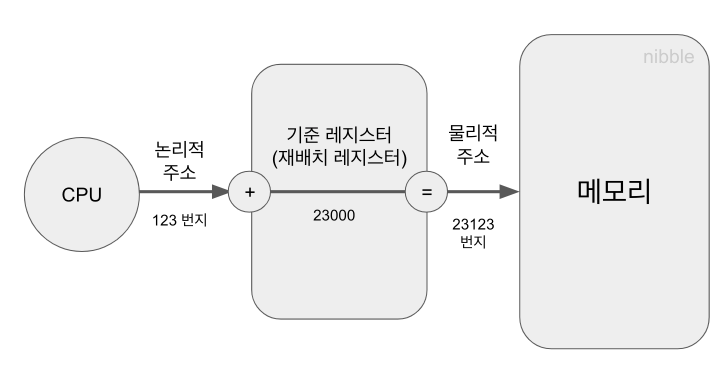
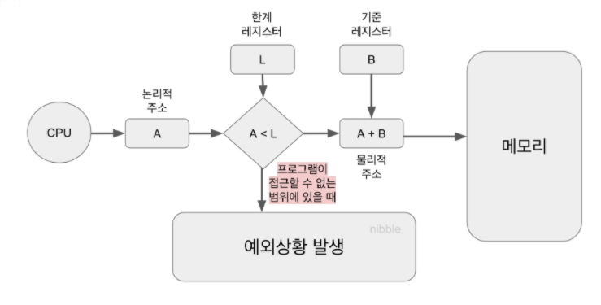
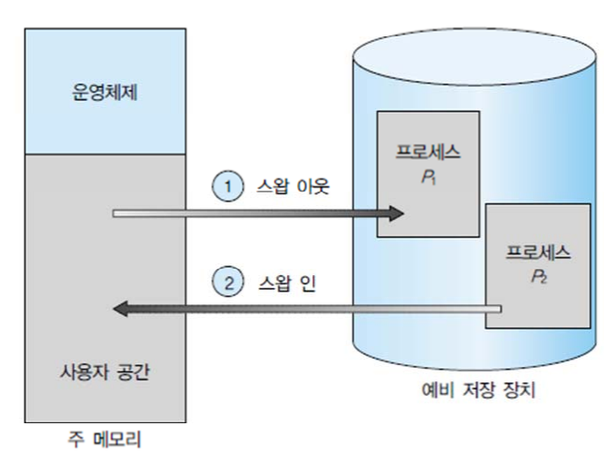
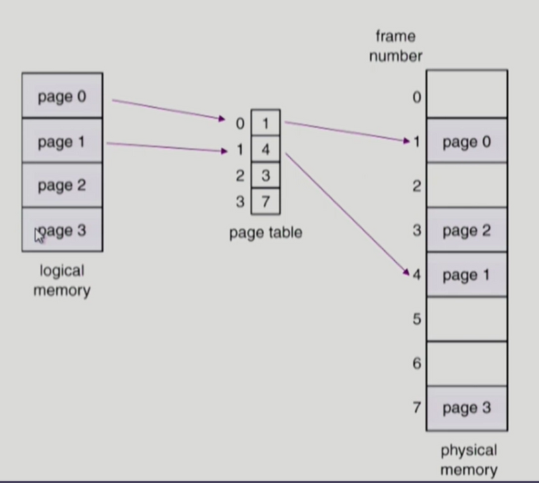
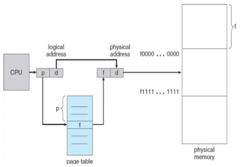
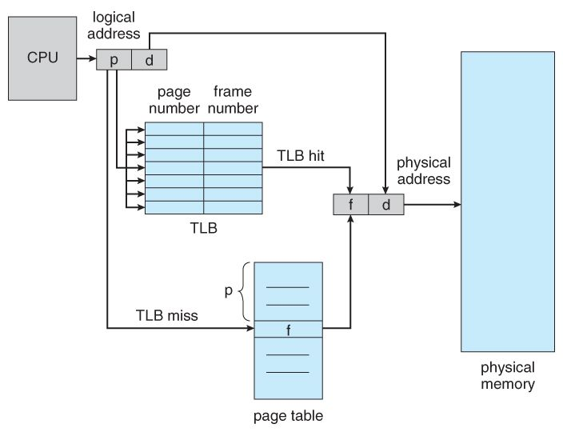
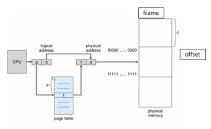
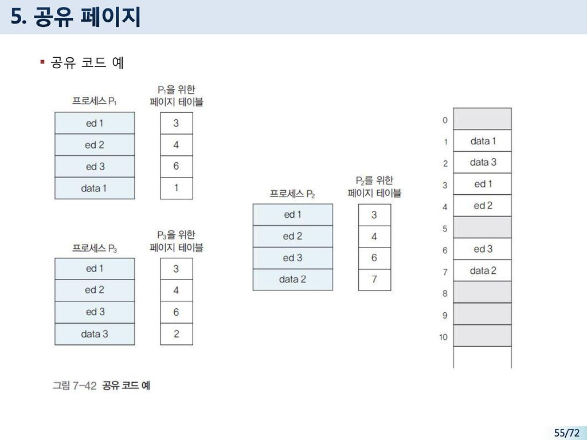

## 목차
- [메모리 관리](#메모리-관리)
  - [주소 바인딩](#주소-바인딩)
    - [주소 바인딩 분류](#주소-바인딩-분류)
    - [MMU 기법](#mmu-기법)
  - [메모리 관리와 관련된 용어](#메모리-관리와-관련된-용어)
    - [동적 로딩](#동적-로딩)
    - [동적 연결](#동적-연결)
    - [중첩](#중첩)
    - [스와핑](#스와핑)
  - [물리적 메모리의 할당 방식](#물리적-메모리의-할당-방식)
    - [연속할당 방식](#연속할당-방식)
    - [불연속할당 방식](#불연속할당-방식)
  - [페이징 기법](#페이징-기법)
    - [주소 변환 기법](#주소-변환-기법)
    - [페이지 테이블의 구현](#페이지-테이블의-구현)
    - [계층적 페이징](#계층적-페이징)
    - [역페이지 테이블](#역페이지-테이블)
    - [공유 페이지](#공유-페이지)
    - [메모리 보호](#메모리-보호)
  - [세그먼테이션](#세그먼테이션)
  - [페이지드 세그먼테이션](#페이지드-세그먼테이션)

# 메모리 관리
메모리는 주소를 통해 접근하는 저장장치이다. 이 때 주소란 서로 다른 위치를 구분하기 위해 사용하는 일련의 숫자로 구성된다.

 

## 주소 바인딩
프로그램이 실행을 위해 메모리에 적재되면 그 프로세스를 위한 독자적인 주소 공간이 생성된다. 이 주소를 논리적 주소 혹은 가상 주소라고 부른다.  

__논리적 주소__
- 각 프로세스마다 독립적으로 할당되며 0번지부터 시작된다.

__물리적 주소__
- 물리적 메모리에 실제로 올라가는 위치
- 일반적으로 메모리의 낮은 주소 영역에는 운영체제가 올라가고, 높은 주소 영역에는 사용자 프로세스들이 올라간다.

프로그램이 실행되기 위해서는 물리적 메모리에 올라가 있어야 한다. 또한 CPU가 기계어 명령을 수행하기 위해 논리적 주소를 통해 메모리 참조를 하게 되면 해당 논리적 주소가 물리적 메모리의 어느 위치에 매핑되는지 확인해야 한다.  
이와 같이 프로세스의 논치적 주소를 물리적 주소로 연결시켜주는 작업을 __주소 바인딩__ 이라고 한다.

### 주소 바인딩 분류
주소 바인딩은 3가지로 분류할 수 있다.  
1. 컴파일 타임 바인딩
   - 물리적 메모리 주소가 프로그램을 컴파일할 때 결정되는 주소 바인딩 방식
   - 현재는 잘 사용하지 않는 기법
2. 로드 타임 바인딩
   - 프로그램의 실행이 시작될 때 물리적 메모리 주소가 결정되는 주소 바인딩 방식
   - 로더 책임하에 물리적 메모리 주소가 부여된다.
   - 로더란 프로그램을 메모리에 적재시키는 프로그램
   - 프로그램이 종료될 때까지 물리적 메모리상의 위치가 고정된다.
3. 실행시간 바인딩
   - 프로그램이 실행을 시작한 후에도 그 프로그램이 위치한 물리적 메모리상의 주소가 변경될 수 있는 바인딩 방식
   - CPU가 주소를 참조할 때마다 해당 데이터가 물리적 메모리의 어느 위치에 존재하는지, 주소 매핑 테이블을 이용해 바인딩을 점검해야 한다.

### MMU 기법

CPU가 특정 프로세스의 논리적 주소를 참조하려고 할 때 MMU 기법은 그 주소값에 기준 레지스터의 값을 더해 물리적 주소값을 얻어낸다.  
MMU 기법에서는 프로그램의 주소 공간이 물리적 메모리의 한 장소에 연속적으로 적재되는 것으로 가정하기 때문에, 해당 프로그램의 물리적 메모리 시작 주소만 알면 주소 변환을 쉽게 할 수 있다. MMU 기법에서 사용자 프로그램이나 CPU는 논리적 주소만 다룰 뿐, 실제 물리적 주소는 알지 못한다.  

__MMU 기법의 기본원리__
- 재배치 레지스터에는 현재 CPU에서 수행 중인 프로세스의 물리적 메모리 시작 주소가 저장되어 있다.
- CPU가 논리적 주소 123번지에 있는 내용을 요청할 경우 재배치 레지스터에 저장된 23000이라는 값에 이 주소를 더해 물리적 메모리 23123번지에 있는 내용을 참조하게 된다.
- 물리적 메모리 23123번지에서 CPU가 요청한 정보를 찾게 된다.  

프로세스는 자기 자신만의 고유한 주소 공간을 가지고 있으므로 같은 주소값이라 하더라도 각 프로세스마다 서로 다른 내용을 담고 있다.  

우리가 흔히 사용하는 다중 프로그램이 환경에서 물리적 메모리 안에는 여러 개의 프로세스가 동시에 올라가 있는 경우가 대부분이다. 따라서 MMU 방식을 사용할 경우 CPU가 요청한 논리적 주소값과 재배치 레지스터 안에 있는 값을 더한 결과가 해당 프로세스의 주소 공간을 벗어나는 경우가 발생할 수 있다. 이를 방지하기 위해 한계 레지스터를 사용한다.  
한계 레지스터는 프로세스가 자신의 주소 공간을 넘어서는 메모리 참조를 하려고 하는지 체크하는 용도로 사용된다.

__메모리 영역 보안 방식__

- CPU가 요청한 프로세스의 논리적 주소값이 한계 레지스터 내에 저장된 해당 프로세스의 크가보다 작은지 확인한다.
- 작다면 논리적 주소값에 재배치 레지스터값을 더해 물리적 주소를 구한 뒤 접근하게 허락한다.
- 반면, 값보다 클 경우 트랩을 발생시켜 강제 종료 시킨다.

 

## 메모리 관리와 관련된 용어

### 동적 로딩
> 동적 로딩  
> 여러 프로그램이 동시에 메모리에 올라가서 수행되는 다중 프로그래밍 환경에서 메모리 사용의 효율성을 높이기 위해 사용하는 기법 중 하나

앞서 소개한 방식에서는 프로세스를 실행시키기 위해 프로세스의 주소 공간 전체가 메모리에 적재되는 환경을 가정했다. 하지만 동적 로딩에서는 해당 부분이 필요할 경우 필요한 부분만 메모리에 적재하는 방식을 사용한다. 따라서 동적 로딩은 메모리를 조금 더 효율적으로 사용할 수 있도록 한다.

### 동적 연결

__연결__ 이란 프로그래머가 작성한 소스 코드를 컴파일하여 생성된 목적 파일과, 이미 컴파일된 라이브러리 파일들을 묶어 하나의 실행파일을 생성하는 과정을 말한다.  

__동적 연결__ 은 컴파일을 통해 생성된 목적 파일과 라이브러리 파일 사이의 연결을 프로그램의 실행 시점까지 지연시키는 기법이다.  

__정적 연결__ 은 프로그래머가 작성한 코드와 라이브러리 코드가 모두 합쳐져서 실행 파일이 생성된다.  

따라서 실행 파일의 크기가 상대적으로 크며, 동일한 라이브러리를 각 프로세스가 개별적으로 메모리에 적재해야 하므로 물리적 메모리가 낭비되는 단점이 있다.  

동적 연결은 라이브러리가 실행 시점에 연결된다. 따라서 미리 메모리에 라이브러리가 적재되어있으면 그 주소에 메모리를 참조하며, 없으면 해당 라이브러리를 메모리에 적재한다.  
라이브러리를 한 번만 적재하므로 메모리 사용의 효율성을 높일 수 있다.  

라이브러리의 위치를 찾기 위해 스텁이라는 작은 코드를 둔다.

### 중첩
> 중첩  
> 프로세스의 주소 공간을 분할해 실제 필요한 부분만을 메모리에 적재하는 기법을 말한다.

동적 로딩과 개념적으로 유사하다.  

동적로딩은 메모리에 더 많은 프로세스를 동시에 올려놓고 실행하기 위한 용도인 반면, 중첩은 단일 프로세스 만을 메모리에 올려놓는 환경에서 메모리 용량보다 큰 프로세스를 실행하기 위한 어쩔 수 없는 선택이다.

### 스와핑
> 스와핑  
> 메모리에 올라온 프로세스의 주소 공간 전체를 디스크 스왑 영역에 일시적으로 내려놓는 것을 말한다.

스왑 영역은 백킹스토어라고도 부르며, 디스크 내에 파일 시스템과는 별도로 존재하는 일정 영역을 말한다. 스왑 영역은 프로세스가 수행 중인 동안에만 디스크에 일시적으로 저장하는 공간이다.  

스와핑은 프로세스의 주소 공간을 일시적으로 메모리에서 디스크로 내려놓는 것을 의미  

스왑 인 : 디스크에서 메모리로 올리는 작업  
스왑 아웃 : 메모리에서 디스크로 내리는 작업  

스와핑의 가장 중요한 역할은 메모리에 존재하는 프로세스의 수를 조절하는 것이다. 너무 많은 프로그램이 메모리에 동시에 올라오게 되면 프로세스당 할당되는 메모리의 양이 지나치게 적어져 시스템 전체의 성능이 크게 떨어진다.

현재 물리적 메모리에 프로세스 P1이 올라와있다고 하자. 프로세스 P2가 실행되고자 하는데 충분한 메모리가 없다면, 운영체제는 메모리 내에 이미 존재하는 P1에 할당된 메모리를 빼앗아 디스크의 스왑 영역으로 스왑 아웃시키고 여유공간에 P1을 스왑인 시킨다.

 

## 물리적 메모리의 할당 방식
물리적 메모리는 운영체제 상주 영역과 사용자 프로세스 영역으로 나뉘어 사용된다.  
운영체제 상주 영역은 인터럽트 벡터와 함께 물리적 메모리의 낮은 주소 영역을 사용하며, 운영체제 커널이 이곳에 위치하게 된다.  
사용자 프로세스 영역은 물리적 메모리의 높은 주소 영역을 사용하며 여러 사용자 프로세스들이 이곳에 적재되어 실행된다.

사용자 프로세스 영역의 관리 방법은 프로세스를 메모리에 올리는 방식에 따라 연속할당 방식과 불연속 할당 방식으로 나누어볼 수 있다.  

 

### 연속할당 방식
> 연속할당 방식  
> 각각의 프로세스를 물리적 메모리의 연속적인 공간에 올리는 방식

물리적 메모리를 고정된 크기의 분할로 미리 나누어 놓는지 그렇지 않은지에 따라 고정분할 방식과 가변분할 방식으로 나뉜다.

__고정분할 방식__  
고정분할 방식은 물리적 메모리를 주어진 개수만큼의 영구적인 분할로 미리 나누어두고 각 분할에 하나의 프로세스를 적재해 실행시킬 수 있게 한다. 하나의 분할에는 하나의 프로그램만 적재할 수 있다. 따라서 동시에 메모리에 올릴 수 있는 프로그램의 수가 고정되어 있다.  

외부조각
- 프로그램의 크기보다 분할의 크기가 작은 경우 해당 분할이 비어 있는데도 불구하고 프로그램을 적재하지 못하기 때문에 생기는 메모리 공간

내부조각
- 프로그램의 크기보다 분할의 크기가 큰 경우 해당 분할에 프로그램을 적재하고 남는 메모리 공간

__가변분할 방식__  
가변분할 방식은 메모리에 적재되는 프로그램의 크기에 따라 분할의 크기, 개수가 동적으로 변하는 방식을 말한다.  

__동적 메모리 할당 문제__ 가 발생한다.  

가변 분할 방식은 프로그램의 크기보다 일부러 크게 할당하지 않기 때문에 내부조각은 발생하지 않는다. 그러나 외부조각은 발생할 가능성이 있는데 이 문제를 해결하기 위한 방법으로 컴팩션이라는 것이 있다.

### 불연속할당 방식
> 불연속할당 방식  
> 하나의 프로세스를 물리적 메모리의 여러 영역에 분산해 적재하는 방식이다.  

불연속할당 방식
- 페이징 기법
  - 하나의 프로그램을 분할하는 기준에 따라 동일한 크기로 나누어 메모리에 적재
- 세그먼테이션 기법
  - 크기와 상관없이 의미 단위로 나누어 메모리에 적재
- 페이지드 세그먼테이션 기법
  - 세그먼테이션을 기본으로 하되 이를 다시 동일 크기의 페이지로 나누어 메모리에 적재

 

## 페이징 기법
> 페이징 기법  
> 프로세스의 주소 공간을 동일한 크기의 페이지 단위로 나누어 물리적 메모리의 서로 다른 위치에 페이지들을 저장하는 방식

페이징 기법에서는 프로세스 주소 공간 전체를 물리적 메모리에 한꺼번에 올릴 필요가 없으며, 일부는 백킹스토어에, 일부는 물리적 메모리에 혼재시키는 것이 가능하다.  

페이징 기법에서는 물리적 메모리를 페이지와 동일한 크기의 프레임으로 미리 나누어둔다. 메모리에 올리는 단위가 동일한 크기의 페이지 단위이므로, 빈 프레임이 있으면 어떤 위치이든 사용될 수 있다. 따라서 페이징 기법은 앞서 연속할당에서 발생했던 동적 메모리 할당 문제가 발생하지 않는다는 장점을 지닌다.

페이징 기법에서는 주소 변환절차가 연속할당 방식에 비해 복잡하다. 그림에서 볼 수 있다싶이 하나의 프로세스라고 하더라도 페이지 단위로 물리적 메모리에 올리기 때문에, 논리적 주소를 물리적 주소로 변환하는 작업이 페이지 단위로 이루어져야하기 때문이다. 따라서 페이징 기법에서는 각각 주소 변환을 위한 페이지 테이블을 가진다.  

페이징 기법에서는 일반적으로 외부조각 문제가 발생하지 않지만, 프로그램의 크기가 항상 페이지 크기의 배수가 된다는 보장이 없기때문에 마지막에 위치한 페이지에서는 내부조각이 발생할 가능성이 있다.

### 주소 변환 기법

페이징 기법에서는 CPU가 사용하는 논리적 주소를 페이지 번호(p)와 페이지 오프셋(d)으로 나누어 주소 변환에 사용한다. 페이지 번호(p)는 페이지 주소 변환 정보를 담고 있는 페이지 테이블 접근 인덱스로 사용되고, 해당 항목에는 페이지의 물리적 메모리상의 시작위치가 저장된다. 페이지 오프셋은 앞서 얻은 물리적 메모리 상의 시작 주소값에 오프셋을 더함으로써 논리적 주소에 대응하는 물리적 주소를 얻을 수 있다.

### 페이지 테이블의 구현
> 페이지 테이블  
> 페이징 기법에서 주소 변환을 하기위한 자료구조로 물리적 메모리에 위치

CPU에서 실행 중인 프로세스의 페이지 테이블에 접근하기 위해 운영체제는 페이지 테이블 기준 레지스터와 페이지 테이블 길이 레지스터를 사용한다. 페이지 테이블 기준 레지스터는 페이지 테이블의 시작 위치를, 페이지 테이블 길이 레지스터는 테이블의 크기를 보관한다.

페이징 기법에서 메모리 접근 연산은 주소 변환을 위해 페이지 테이블에 접근하는 것과 변환된 주소에서 실제 데이터에 접근하는 것, 이렇게 두 번의 메모리 접근을 필요로 한다. 이러한 오버헤드를 줄이기 위해 TLB라고 불리는 고속의 주소 변환용 하드웨어 캐시가 사용되기도 한다.  

메모리에 비해 TLB는 비싸므로 페이지 테이블에 대한 모든 정보를 담을 수 없다. 그렇기 때문에 TLB에는 요청되는 페이지에 대한 주소 변환 정보가 있을 수도 있고 없을 수 도 있다. 만약 TLB에 요청하는 페이지 번호가 존재한다면, 바로 물리적 메모리의 번호를 얻을 수 있지만, 없다면 페이지 테이블로 부터 번호를 알아내야한다.

### 계층적 페이징
현대의 컴퓨터는 주소 공간이 큰 프로그램을 지원한다.  
만약 4GB의 주소공간을 갖는 프로그램이 있고 페이지 크기가 4KB라고 가정하면 1M개의 페이지 테이블 항목이 필요하게 된다. 그렇다면 한 프로세스당 페이지 테이블을 위해 4MB 크기의 메모리 공간이 필요하게 되는데 이는 주소 공간 낭비라고 볼 수 있다.따라서 페이지 테이블에 사용되는 메모리 공간의 낭비를 줄이기 위해 2단계 페이징 기법을 사용한다.  

2단계 페이징 기법에서는 주소 변환을 위해 외부 페이지 테이블과 내부 페이지 테이블의 두 단계에 걸친 페이지 테이블을 사용한다. 사용하지 않는 주소 공간에 대해서는 외부 페이지 테이블의 항목은 NULL로 설정하며, 여기에 대응하는 내부 페이지 테이블을 생성하지 않는다.

프로세스의 주소 공간이 커질수록 페이지 테이블의 크기도 커지므로 주소 변환을 위한 메모리 공간 낭비 역시 심각해진다. 2단계, 3단계, 4단계 다단계 페이지 테이블이 필요해진다. 하지만 이렇게 다단게 페이지를 사용하게 되면 메모리 공간의 소모는 줄일 수 잇지만 메모리에 대한 접근 횟수가 많아지기 때문에 접근시간이 크게 늘어난다.  
이 오버헤드를 줄이기 위해 TLB를 사용하는 것이 효과적이다. TLB를 함께 사용하면 공간적 비용도 줄일 수 있을 뿐만 아니라 시간의 효율성까지 얻을 수 있다.

### 역페이지 테이블
> 역페이지 테이블  
> 물리적 메모리의 페이지 프레임 하나당 페이지 테이블에 하나씩의 항목을 두는 방식  
> 논리적 주소에 대해 페이지 테이블을 만드는 것이 아닌, 물리적 주소에 대해 페이지 테이블을 만드는 것

페이지 테이블로 인한 메모리 공간의 낭비가 심한 이유는 모든 프로세스의 모든 페이지에 대해 페이지 테이블 항목을 다 구성해야하기 때문이다. 이 문제를 해결하기 위한 대안으로 역페이지 테이블 기법이 사용될 수 있다.

주소 변환 작업이 논리적 주소 -> 물리적 주소 라면 역페이지 테이블은 물리적 주소로부터 논리적 주소를 얻기 위한 구조로 되어있다. 역페이지 테이블에 주소 변환 요청이 들어오면, 그 주소를 담은 페이지가 물리적 메모리에 존재하는지 여부를 판단하기 위해 페이지 테이블 전체를 다 탐색하기 때문에 비효율적이다.  

### 공유 페이지
공유 코드는 메모리 공간 효율을 위해 여러 프로세스에 의해 공통으로 사용될 수 있도록 작성된 코드를 말한다. 공유 페이지란 이러한 공유 코드를 담고 있는 페이지를 말한다. 공유 코드는 읽기 전용 특성을 가진다. 또한 공유 페이지는 해당 페이지를 공유하는 모든 프로세스의 주소 공간에서 동일한 페이지 번호를 가져야 한다.

사유 페이지는 공유 페이지와 반대로 프로세스들이 공유하지 않고 프로세스 별로 독자적으로 사용하는 페이지를 말한다.

위의 그림을 보면 프로세스 P1, P2, P3의 공유 코드 ed1, ed2, ed3가 한 메모리에 들어가있고 data 1, 2, 3이 각기 다른 메모리에 올라가 있는 것을 볼 수 있다.

### 메모리 보호
페이지 테이블에는 메모리 보호를 위해 보호 비트와 유효-무효 비트를 가지고 있다.

__보호 비트__
- 각 페이지에 대한 접근 권한의 내용을 담고 있음
- 프로세스의 주소 공간은 다른 프로세스에 의해 접근 될 수 없으므로 '누구'에 해당하는 개념은 없고 '어떠한' 접근을 허용하는지 저장된다.
- 읽기-쓰기, 읽기 전용 접근 권한 설정

__유효-무표 비트__
- 해당 페이지 내용이 유효한지에 대한 내용을 담고 잇음
- 유효로 세팅되어있는 경우 
  - 메모리 프레임에 페이지가 존재함을 뜻함
  - 접근이 허용됨.
- 무효로 세팅되어있는 경우
  - 프로세스가 그 주소 부분을 사용하지 않음
  - 해당 페이지가 물리적 메모리에 올라와 있지 않고 백킹스토어에 존재해 유효한 접근 권한이 없다는 의미를 지님

 

## 세그먼테이션
> 세그먼테이션  
> 프로세스의 주소 공간을 의미 단위의 세그먼트로 나누어 물리적 메모리에 올리는 세그먼테이션 기법

하나의 프로세스를 구성하는 주소 공간은 일반적으로 코드, 데이터, 스택 등의 의미 있는 단위로 구성된다. 세그먼트는 이와 같이 주소 공간을 기능 또는 의미 단위로 나눈 것을 뜻한다.

 

## 페이지드 세그먼테이션
> 페이지드 세그먼테이션  
> 페이징 기법과 세그먼테이션 기법의 장점만을 취하는 주소 변환 기법

세그먼테이션 기법과 마찬가지로 프로그램을 의미 단위의 세그먼트로 나눈다. 세그먼트가 임의의 길이를 가질 수 있는 것이 아니라 반드시 동일한 크기 페이지들의 집합으로 구성된다.  

하나의 세그먼트 크기를 페이지 크기의 배수가 되도록 함으로써 세그먼테이션 기법에서 발생하는 외부조각의 문제점을 해결한다.  
또한 세그먼트 단위로 프로세스 간의 공유나 프로세스 내의 접근 권한 보호가 이루어지도록 함으로써 페이징 기법의 약점을 해소한다.