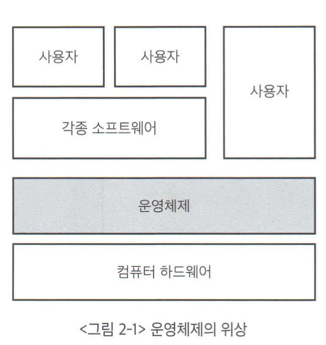
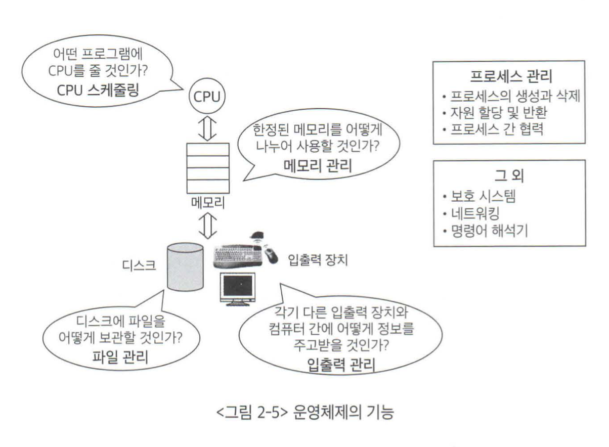

## 목차
- [운영체제 개요](#운영체제-개요)
  - [운영체제의 정의](#운영체제의-정의)
  - [운영체제의 기능](#운영체제의-기능)
  - [운영체제의 분류](#운영체제의-분류)
    - [다중사용자에 대한 동시 지원 여부](#다중사용자에-대한-동시-지원-여부)
    - [작업을 처리하는 방식에 따른 분류](#작업을-처리하는-방식에-따른-분류)
  - [운영체제의 자원 관리 기능](#운영체제의-자원-관리-기능)
    - [CPU 스케줄링](#cpu-스케줄링)
    - [메모리 관리](#메모리-관리)
    - [주변 장치 및 입출력 장치 관리](#주변-장치-및-입출력-장치-관리)

# 운영체제 개요

## 운영체제의 정의
> 운영체제  
> 컴퓨터 하드웨어 바로 윗단에 설치되는 소프트웨어

운영체제는 사용자 및 다른 모든 소프트웨어와 하드웨어를 연결하는 소프트웨어 계층으로 위의 그림과 같다.  
사용자는 하드웨어 자체를 직접 다루기 쉽지 않으므로, 하드웨어 위에 기본적으로 운영체제를 탑재해 전원을 켰을 때 손쉽게 사용할 수 있는 상태가 되도록한다.  

소프트웨어가 컴퓨터 시스템에서 실행되기 위해서는 메모리에 그 프로그램이 올라가 있어야한다. 운영체제 자체도 하나의 소프트웨어로서 전원이 켜짐과 동시에 메모리에 올라간다. 이 때, 메모리에 상주하는 운영체제의 부분을 커널이라고 부르며, 남은 운영체제는 필요할 때 메모리에 올려 사용한다.

- 좁은 의미의 운영체제
  - 커널(운영체제 코드 중에서도 핵심적인 부분)
- 넓은 의미의 운영체제
  - 커널뿐만이 아닌 시스템을 위한 유틸리티들을 광범위하게 포함한다.
  - 예를 들어, MS 윈도우 환경에서 파일을 복사하는 프로그램 등이 해당

 

## 운영체제의 기능
> 운영체제의 역할은 하드웨어를 위한 역할과 사용자를 위한 역할 두 가지로 나눌 수 있다.

- 사용자 편의 기능
  - 운영체제는 사용자가 다루기 힘든 복잡한 부분을 대신 맡아 처리하고, 사용자는 자세한 내용을 알지 못해도 프로그램을 실행할 수 있게 도와준다.
  - 예를 들어 사용자는 파일이 디스크에 어떻게 저장되는지 자세히 모르지만, 운영체제가 제공하는 편리한 인터페이스를 통해 파일을 손쉽게 저장하거나 파일의 내용을 꺼내볼 수 있다.
- 자원 관리 기능
  - 운영체제는 컴퓨터 시스템 내의 자원을 효율적으로 관리하는 일도 한다.
  - CPU, 메모리, 하드디스크 등 하드웨어 뿐만이 아닌 소프트웨어 자원까지 관리한다.
  - 운영체제는 자원을 효율적으로 관리해 가장 좋은 성능을 내도록 한다.
- 보안 및 보호 기능
  - 악의성 프로그램을 작성해 다른 사용자 프로그램이 올라가 있는 메모리 영역을 참조
  - 다른 사용자의 사적인 파일에 접근
  - 운영체제 자체가 올라가 있는 메모리 영역 변경
  - 운영체제는 위와 같은 위험으로부터 보호를 하는 기능도 수행한다.

 

## 운영체제의 분류
> 운영체제는 동시 작업을 지원하는지의 여부에 따라 단일작업용 운영체제와 다중작업용 운영체제로 나눌 수 있다.

__단일작업용 운영체제__  
단일작업용 운영체제는 한 번에 하나의 프로그램만 실행시킬 수 있는 운영체제다. 초창기 운영체제는 대개 단일작업용 운영체제에 해당되었다.  

__다중작업용 운영체제__  
최근에는 대부분의 운영체제가 동시에 2개 이상의 프로그램을 처리할 수 있는 다중작업을 지원한다.  
운영체제가 다중작업을 처리할 때에는 여러 프로그램이 CPU와 메모리를 공유하게 된다. 이 때, CPU는 매 순간 하나의 프로그램만 처리할 수 있기 때문에 여러 프로그램을 실행했다고 해서 동시에 실행되는 것이 아닌 번갈아 가면서 실행되는 것이다. CPU의 처리 속도가 워낙 빨라 사용자 입장에서는 동시에 처리되는 것처럼 보이는 것이다. 이와 같이 CPU의 작업시간을 여러 프로그램들이 조금씩 나누어 쓰는 시스템을 시분한 시스템이라고 부른다.  

### 다중사용자에 대한 동시 지원 여부
단일 사용자용 운영체제
- 한 번에 한 명의 사용자만이 사용하도록 허용하는 운영체제

다중 사용자용 운영체제
- 여러 사용자가 동시에 접속해 사용할 수 있게 하는 운영체제

### 작업을 처리하는 방식에 따른 분류

__일괄처리__
- 요청된 작업을 일정량씩 모아서 한꺼번에 처리하는 방식
- 모든 작업이 완전히 종료된 후에 결과를 얻을 수 있음
- 사용자 입장에서는 응답시간이 길다는 단점
- 예시로는 초창기 컴퓨터에 사용되던 펀치 카드 처리 시스템

__시분할 방식__
- 여러 작업을 수행할 때 컴퓨터의 처리 능력을 일정한 시간 단위로 분할해 사용하는 방식이다.
- 현재 대부분의 컴퓨터는 시분할 방식을 사용한다.
- 사용자의 요청에 대한 결과를 곧바로 얻을 수 있는 시스템을 대화형 시스템
  - 이는 시분할 방식의 대표적인 특징이다.

__실시간 운영체제__
실시간 운영체제는 정해진 시간 안에 어떠한 일이 반드시 처리됨을 보장해야 하는 시스템에서 사용된다.

- 예) 원자로, 공장 제어 시스템, 미사일 제어 시스템 등
- 실시간 시스템은 경성 실시간 시스템과 연성 실시간 시스템 두 가지로 나눌 수 있다.
  - 경성 실시간 시스템은 주어진 시간을 지키지 못할 경우 매우 위험한 결과를 초래할 수 있는 시스템이다.
  - 예) 로켓, 원자로 제어 시스템
  - 연성 실시간 시스템은 위험한 결과를 초래하지는 않지만, 내용이 정확히 전달되지 않을 우려가 있다.
  - 예) 멀티 미디어 스트리밍 시스템

 

## 운영체제의 자원 관리 기능

### CPU 스케줄링  
CPU를 관리하는 방법  
6장에서 자세히 다룰 예정

CPU 스케줄링의 목표는 CPU를 가장 효율적으로 사용하면서도, 특정 프로세스가 불이익을 당하지 않도록 하는 것이다.  
선입선출, 라운드 로빈, 우선순위 기법이 있다.

### 메모리 관리
운영체제의 또 다른 중요 관리 대상으로 메모리가 있다.  
프로그램이 CPU에서 실행되려면 해당 부분이 메모리로 올라가 있어야 한다. 이 때 한정된 메모리 공간에 여러 프로그램을 수용하려면 메모리에 대한 효율적인 관리 메커니즘이 필요하다.  
7장에서 자세히 다룰 예정

### 주변 장치 및 입출력 장치 관리
주변 장치 및 입출력 장치는 CPU나 메모리와 달리 __인터럽트__  라는 메커니즘을 통해 관리가 이루어진다.  

CPU는 평소에 CPU 스케줄링에 따라 자기에게 주어진 작업을 수행하다가 인터럽트가 발생하면 하던 일을 잠시 멈추고 인터럽트에 의한 요청 서비스를 수행한다.  
예를 들어 사용자가 키보드의 글자를 입력하면 키보드는 CPU에 인터럽트를 발생시켜 사용자로부터 입력이 들어왔음을 알린다. CPU는 하던 작업을 멈추고 인터럽트로 인해 처리해야할 작업을 수행한다. 키보드에 의해 인터럽트가 발생한 경우 사용자의 입력 데이터를 프로그램에 전달하는 절차를 수행한다.  
